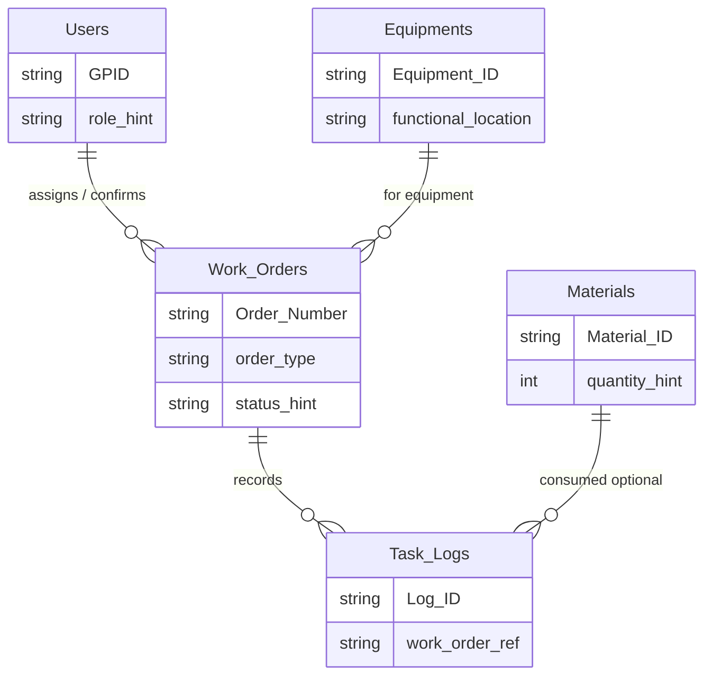
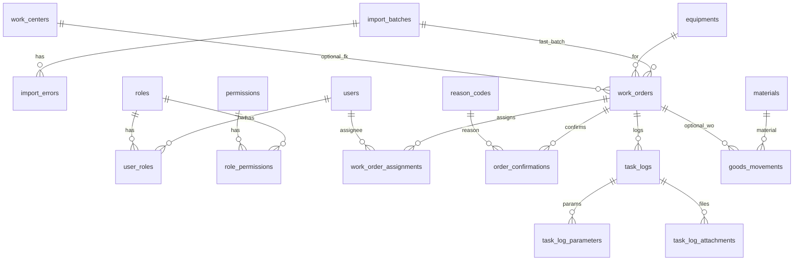

# Database design (draft)

สถานะ: **ร่าง (Draft)** — ใช้เป็นฐานออกแบบเชิงตรรกะและต่อยอดเป็น data dictionary / DDL หลังแมปคอลัมน์ SAP รอบสุดท้าย

## อ้างอิง

| แหล่ง | หมายเหตุ |
|--------|-----------|
| [Software Requirement Specification Pepsi Cola PM Project.docx](Software%20Requirement%20Specification%20Pepsi%20Cola%20PM%20Project.docx) | **เสริม:** ภาคผนวก ก, บท 4 — cross-ref (แหล่งหลักความต้องการ: ชุด PM Application Requirement* ใน `from customer/` ตาม [`PROJECT_PLAN.md`](PROJECT_PLAN.md)) |
| [PROJECT_PLAN.md](PROJECT_PLAN.md) | ขอบเขตฟีเจอร์ F01–F12 และ SRS-ID |
| [PROJECT_STRUCTURE.md](PROJECT_STRUCTURE.md) | **Tree view:** โครงสร้าง repo + ฐาน `pepsi_pm` + คอลัมน์ตาม migration |
| [FRONTEND_STRUCTURE.md](FRONTEND_STRUCTURE.md) | **Tree view:** แนวทาง `frontend/` (React + TS + Vite, features, Fxx) |
| [BACKEND_STRUCTURE.md](BACKEND_STRUCTURE.md) | **API + middleware:** Express พอร์ต 5000, เชื่อม `pepsi_pm` |
| [api/openapi.yaml](api/openapi.yaml) | สัญญา REST ร่าง (imports, batches, work-orders) |
| [PROGRAM_FLOW.md](PROGRAM_FLOW.md) | ลำดับการทำงาน (Mermaid flow / sequence) |
| [ER_DIAGRAM.md](ER_DIAGRAM.md) | ER ระดับ physical ตาม migration (Mermaid) |
| [CUSTOMER_FROM_FOLDER_MANIFEST.md](CUSTOMER_FROM_FOLDER_MANIFEST.md) | รายการไฟล์ใต้ `from customer/` |
| [SAP_DATA_IMPORT_EXPORT_COLUMNS.md](SAP_DATA_IMPORT_EXPORT_COLUMNS.md) | **คอลัมน์ตัวอย่าง** จาก `from customer/SAP data` (import จากไฟล์ SAP / อ้างอิง export) |

---

## 1. ขอบเขตและสมมติฐาน

- **ชื่อฐานข้อมูล (ล็อกใน repo):** `pepsi_pm` — สร้างด้วย `CREATE DATABASE IF NOT EXISTS` และ `USE` ใน [`database/migrations/V001__initial_schema.sql`](../database/migrations/V001__initial_schema.sql); รายการรันและตัวแปรแนะนำอยู่ที่ [`database/README.md`](../database/README.md)  
  - ถ้าต้องแยกสภาพแวดล้อมบน **instance เดียว** ให้ใช้ชื่ออื่น (เช่น `pepsi_pm_uat`) โดยแก้บรรทัด `CREATE DATABASE` / `USE` ใน migration ฉบับท้องถิ่น หรือสร้าง DB แล้วรันไฟล์หลังตัดบล็อก §0 ออก — **ชื่อล็อกมาตรฐานของโครงการยังคือ `pepsi_pm`**
- ฐานหลักของแอปตาม SRS ใช้ **MariaDB** (อ้างอิงใน SRS บท 3 และภาคผนวก ก)
- ข้อมูล master หลักของใบงาน/แผนมาจาก **SAP** — ในแอปอาจแยกชั้น **staging / import snapshot** กับ **ตาราง operational** ที่ผู้ใช้แก้ไข (Reason code, confirm เวลา, ไฟล์แนบ ฯลฯ)
- รายละเอียดคอลัมน์ระดับ physical ยังไม่ล็อกในเอกสารนี้ — ใช้ [`SAP_DATA_IMPORT_EXPORT_COLUMNS.md`](SAP_DATA_IMPORT_EXPORT_COLUMNS.md) เป็น data dictionary จากตัวอย่างใน `from customer/SAP data` และอัปเดตด้วย `python scripts/extract_sap_data_columns.py`

---

## 2. เอนทิตีหลัก (จากภาคผนวก ก)

| ตาราง (แนวคิด) | คำอธิบาย | Primary key (SRS) |
|-----------------|----------|-------------------|
| **Users** | พนักงานและสิทธิ์ (เช่น GPID, Role) | `GPID` |
| **Equipments** | เครื่องจักร / ผูก Functional Location จาก SAP | `Equipment_ID` |
| **Work_Orders** | ใบงาน PM/CM (ZB01, ZB02, ZB05) ที่นำเข้าจาก SAP | `Order_Number` |
| **Task_Logs** | บันทึกพารามิเตอร์หน้างานและหลักฐาน (รูป) | `Log_ID` |
| **Materials** | อะไหล่ / จำนวนสำหรับเบิกจ่าย | `Material_ID` |

SRS ระบุระดับชื่อตารางและ PK — **ยังไม่ระบุคอลัมน์ครบ** ในภาคผนวก ก

---

## 3. ความสัมพันธ์เชิงตรรกะ (ร่าง)



หมายเหตุ: ความสัมพันธ์ **Users ↔ Work_Orders** อาจเป็น assignee หลายคน / ประวัติ — ใน v0.2 แยกเป็น `work_order_assignments` (ดู **§8.9** และ ER **§9**)

---

## 4. ฟิลด์เชิงพฤติกรรมจากตาราง SRS (บท 4) — ไม่ใช่ DDL

ใช้ช่วยออกแบบคอลัมน์ใน `Task_Logs` / ตารางย่อย ไม่ครบทุก UC:

- **Scheduling / assign** (ตารางตัวอย่างใน SRS): Work Order No., Assigned Technician — ผูก Work Center / GPID
- **Handheld / parameter**: QR เครื่องจักร, Parameter Value (ทศนิยมจำกัดตาม SRS)
- **Material**: Barcode Material (รหัส SAP), Quantity (ไม่เกินสต็อก)
- **รายงาน / KPI**: % Utilization, Backlog count — ส่วนใหญ่คำนวณจากข้อมูลที่มีหรือ snapshot ไม่จำเป็นต้องเก็บเป็นตารางถาวรทั้งหมด

---

## 5. แนวทาง staging และนำเข้า SAP

1. **นำเข้าไฟล์/export** (IW37N, Confirm, GI/GR ฯลฯ) → ตาราง staging ตามชุดคอลัมน์ไฟล์ (ชื่อตารางชั่วคราวเช่น `stg_iw37n_*`)  
2. **Normalize** → `Work_Orders`, `Equipments`, … ตามกฎ validation ใน SRS  
3. **เก็บ raw hash หรือ batch id** เพื่อ idempotent import และ audit (ออกแบบรายละเอียดในขั้น DDL)

---

## 6. งานที่เหลือก่อนล็อก DDL

- [ ] DDL ร่างแรก: รีวิว/ปรับ [`database/migrations/V001__initial_schema.sql`](../database/migrations/V001__initial_schema.sql) หลังล็อก mapping SAP — ดู **§11.1**
- [ ] Data dictionary: ทบทวนคอลัมน์ใน [`SAP_DATA_IMPORT_EXPORT_COLUMNS.md`](SAP_DATA_IMPORT_EXPORT_COLUMNS.md) คู่กับ `IW37N & MB51 template.xlsx` (ราก `from customer/`) แล้วล็อก mapping ฉบับสุดท้าย  
- [ ] กำหนดชนิดข้อมูล MariaDB, index (เช่น `Order_Number`, `Equipment_ID`, วันที่แผน) — ดูต้นแบบใน **§11**  
- [ ] ตาราง audit / Reason code / ไฟล์แนบ (path บน D: ตาม SRS) — โครงร่างใน **§8.10–§8.15**  
- [ ] สิทธิ์ RBAC (F10) — โครงร่าง normalize ใน **§8.14** (หรือ JSON policy ถ้าทีมเลือก)  
- [ ] นโยบการลบ/เก็บ log retention  
- [ ] ยืนยันกับ MM/PM: การส่ง confirm / movement กลับ SAP (มีผลต่อ `sync_to_sap_status` และตาราง staging เพิ่มเติม)

---

## 7. ชั้นข้อมูล (แนวทางปฏิบัติ)

| ชั้น | บทบาท | ตัวอย่างชื่อตาราง (ร่าง) |
|------|--------|---------------------------|
| **Staging** | เก็บแถวดิบจากไฟล์ SAP / export ตามคอลัมน์จริงของไฟล์ | `stg_iw37n_row`, `stg_confirm_wo_row`, `stg_mb51_row` |
| **Reference** | Master อ้างอิงบ่อย | `equipments`, `work_centers`, `materials`, `users` |
| **Operational** | ใบงานและ workflow ในแอป | `work_orders`, `work_order_assignments`, `order_confirmations` |
| **Movement** | GI/GR หลัง normalize | `goods_movements` |
| **Evidence** | Handheld / หลักฐาน | `task_logs`, `task_log_parameters`, `task_log_attachments` |
| **Config** | Reason, RBAC | `reason_codes`, `roles`, `permissions`, `role_permissions`, `user_roles` |
| **Platform** | Import / audit | `import_batches`, `import_errors`, `audit_log` |
| **Aggregate (ทางเลือก)** | KPI หนัก | `kpi_daily_snapshots` |

หลักการ: **SAP = source of truth** สำหรับเลขใบงานและข้อมูลที่ซิงก์มา — แอปเก็บเพิ่มเติมสิ่งที่ UI และกฎลูกค้าต้องใช้ (มอบหมาย, Reason, ไฟล์แนบ, audit)

---

## 8. Logical tables (v0.2) — checklist คอลัมน์

ชื่อตารางเป็น **แนวทาง MariaDB** (`snake_case`) — ยังไม่ใช่ DDL ล็อกสุดท้าย  
`*` ในคอลัมน์ “หมายเหตุ” = แนะนำให้มี index / ใช้ใน query หลักบ่อย

### 8.1 `import_batches`

| คอลัมน์ | หมายเหตุ |
|---------|----------|
| `id` | PK `BIGINT` |
| `source_kind` | เช่น `iw37n`, `confirm_wo`, `mb51` |
| `source_file_name` | ชื่อไฟล์ต้นทาง |
| `source_sha256` | hash เนื้อไฟล์ — idempotent import |
| `imported_by_user_id` | FK → `users.id` |
| `started_at`, `finished_at` | `DATETIME(3)` |
| `status` | `pending` / `success` / `partial` / `failed` |
| `row_count_accepted`, `row_count_rejected` | สถิติ |

### 8.2 `import_errors`

| คอลัมน์ | หมายเหตุ |
|---------|----------|
| `id` | PK |
| `import_batch_id` | FK → `import_batches` * |
| `source_row_number` | บรรทัดในไฟล์ (ถ้ามี) |
| `error_code`, `error_message` | |
| `raw_excerpt` | สตริงย่อ (ไม่เก็บไฟล์เต็มใน DB ยกเว้นจำเป็น) |

### 8.3 Staging (แยกตามชุดคอลัมน์จริง)

| ตาราง | หมายเหตุ |
|--------|----------|
| `stg_iw37n_row` | คอลัมน์ตามไฟล์ IW37N ที่ใช้ — อ้าง [`SAP_DATA_IMPORT_EXPORT_COLUMNS.md`](SAP_DATA_IMPORT_EXPORT_COLUMNS.md); ทุกแถวมี `import_batch_id` |
| `stg_confirm_wo_row` | คอลัมน์ตาม Confirm WO (`Order`, `Equipment`, `Act.start`, `Sys.Status`, …) |
| `stg_mb51_row` | คอลัมน์ตาม MB51 / movement |

กฎ: **ไม่ FK จาก staging ไป operational** — job อ่าน staging แล้ว upsert ตาราง operational

### 8.4 `users`

| คอลัมน์ | หมายเหตุ |
|---------|----------|
| `id` | PK |
| `gpid` | UK — รหัสพนักงานตาม SRS / โรงงาน |
| `display_name`, `email` | |
| `is_active` | |
| `created_at`, `updated_at` | |

### 8.5 `equipments`

| คอลัมน์ | หมายเหตุ |
|---------|----------|
| `id` | PK |
| `equipment_id_sap` | UK หรือ UK ร่วมกับ `plant` ถ้าเลขซ้ำข้าม plant * |
| `functional_location` | |
| `description` | |
| `plant` | ถ้ามีหลาย plant |
| `synced_at` | |

### 8.6 `work_centers`

| คอลัมน์ | หมายเหตุ |
|---------|----------|
| `id` | PK |
| `work_center_code` | UK ต่อ `plant` (ถ้าใช้) |
| `plant`, `description` | |
| `synced_at` | |

รุ่นแรกอาจเก็บ `work_center_planned` / `work_center_actual` เป็นสตริงใน `work_orders` โดยไม่ FK — ค่อย normalize เมื่อข้อมูลนิ่ง

### 8.7 `materials` (master)

| คอลัมน์ | หมายเหตุ |
|---------|----------|
| `id` | PK |
| `material_number_sap` | UK |
| `description`, `base_uom` | |
| `barcode_hint` | ถ้าใช้ตาม SRS handheld |

### 8.8 `work_orders`

| คอลัมน์ | หมายเหตุ |
|---------|----------|
| `id` | PK |
| `order_number` | UK — เลขใบงาน SAP * |
| `order_type` | ZB01 / ZB02 / ZB05 ฯลฯ |
| `equipment_id` | FK → `equipments` * |
| `work_center_planned`, `work_center_actual` | สอด `WkCtrPln` / `WkCtrAct` ใน Confirm |
| `system_status`, `user_status` | ถ้ามีในไฟล์ |
| `planned_start`, `planned_finish`, `basic_start`, `basic_finish` | ตาม IW37N / Confirm |
| `last_import_batch_id` | FK → `import_batches` |
| `ui_metadata_json` | ทางเลือก — snapshot จาก SAP โดยไม่ระเบิดจำนวนคอลัมน์ในรอบแรก |
| `created_at`, `updated_at` | |

### 8.9 `work_order_assignments`

รองรับหลายคนและประวัติการมอบหมาย (ไม่เก็บ technician คนเดียวใน `work_orders`)

| คอลัมน์ | หมายเหตุ |
|---------|----------|
| `id` | PK |
| `work_order_id` | FK → `work_orders` * |
| `user_id` | FK → `users` * |
| `assigned_at` | * composite index กับ `work_order_id` |
| `assigned_by_user_id` | FK → `users` |
| `unassigned_at` | nullable |
| `role` | เช่น `primary`, `assistant` |

### 8.10 `reason_codes`

| คอลัมน์ | หมายเหตุ |
|---------|----------|
| `id` | PK |
| `code` | UK — สอดภาคผนวก ข + Details Rev.1 |
| `label_th`, `label_en` | |
| `sort_order` | |
| `requires_when_status` | ทางเลือก — กฎบังคับ Reason ตามสถานะ (ออกแบบคู่ UI) |
| `is_active` | |

### 8.11 `order_confirmations` (การยืนยันในแอป — คนละชั้นกับแถวดิบใน `stg_confirm_wo_row`)

| คอลัมน์ | หมายเหตุ |
|---------|----------|
| `id` | PK |
| `work_order_id` | FK → `work_orders` * |
| `confirmed_by_user_id` | FK → `users` |
| `actual_start`, `actual_finish` | |
| `actual_work_hours` | |
| `reason_code_id` | FK → `reason_codes` |
| `notes` | |
| `sync_to_sap_status` | `pending` / `sent` / `not_applicable` — ล็อกกับทีม SAP |
| `created_at` | |

### 8.12 `goods_movements`

| คอลัมน์ | หมายเหตุ |
|---------|----------|
| `id` | PK |
| `movement_kind` | `GI` / `GR` |
| `work_order_id` | FK nullable ถ้าไฟล์ไม่ผูกใบงาน |
| `material_id` | FK → `materials` |
| `quantity` | `DECIMAL` |
| `posting_date`, `plant`, `storage_location` | ตาม MB51 |
| `sap_document_reference` | |
| `import_batch_id` | FK |
| `created_at` | |

### 8.13 `task_logs` และตารางย่อย

**`task_logs`**

| คอลัมน์ | หมายเหตุ |
|---------|----------|
| `id` | PK |
| `work_order_id` | FK * |
| `log_type` | `parameter` / `note` / `photo` / … |
| `created_by_user_id` | FK |
| `created_at` | * |

**`task_log_parameters`**

| คอลัมน์ | หมายเหตุ |
|---------|----------|
| `id` | PK |
| `task_log_id` | FK → `task_logs` |
| `parameter_code` | |
| `value_numeric`, `value_text` | |
| `unit` | |

**`task_log_attachments`**

| คอลัมน์ | หมายเหตุ |
|---------|----------|
| `id` | PK |
| `task_log_id` | FK → `task_logs` |
| `storage_path` | path บน **D:** ตาม SRS — ไม่เก็บ blob ใหญ่ใน DB ยกเว้นจำเป็น |
| `mime_type`, `byte_size` | หลังบันทึกไฟล์จริง — สำหรับรูปหลักฐาน (before/after ฯลฯ) ให้เป็น **`image/webp`** และ `byte_size` ตามไฟล์ WebP หลังแปลง |
| `created_at` | |

**นโยบายรูป:** แปลง raster เป็น **WebP ก่อนบันทึกถาวร** (ลดพื้นที่ดิสก์และ backup) — ดู [`MEDIA_WEBP_POLICY.md`](MEDIA_WEBP_POLICY.md)

### 8.14 RBAC (F10)

| ตาราง | คอลัมน์สำคัญ |
|--------|----------------|
| `roles` | `id`, `code` UK, `label` |
| `permissions` | `id`, `code` UK — เช่น `work_order.view`, `work_order.assign`, `order_confirmation.create`, `goods_movement.view` |
| `role_permissions` | (`role_id`, `permission_id`) PK แบบ composite |
| `user_roles` | (`user_id`, `role_id`) PK composite; ทางเลือก `valid_from`, `valid_until` |

### 8.15 `audit_log`

| คอลัมน์ | หมายเหตุ |
|---------|----------|
| `id` | PK |
| `entity_type`, `entity_id` | แบบ polymorphic — หรือแยกตารางต่อ entity ตอน DDL |
| `action` | `create` / `update` / `delete` / `import` |
| `actor_user_id` | FK |
| `payload_json` | สรุป before/after |
| `created_at` | * |

### 8.16 `kpi_daily_snapshots` (ทางเลือก — F09)

| คอลัมน์ | หมายเหตุ |
|---------|----------|
| `id` | PK |
| `snapshot_date`, `plant` | UK composite |
| `metrics_json` | หรือแยกคอลัมน์ต่อ KPI หลังล็อกสูตรกับ requirement_13_02_63 |

---

## 9. ER เชิงตรรกะ (ขยาย v0.2)



หมายเหตุ: เส้น `work_centers` ↔ `work_orders` เป็นแนวทางเมื่อ normalize แล้ว — ถ้ารุ่นแรกเก็บ WC เป็นสตริงใน `work_orders` ให้ละเส้นนี้ออกจาก DDL จริง

**ER แบ่งตามตารางจริง + staging / V003:** [`ER_DIAGRAM.md`](ER_DIAGRAM.md) · **ลำดับกระบวนการแอป:** [`PROGRAM_FLOW.md`](PROGRAM_FLOW.md)

---

## 10. แมป F01–F12 → ตารางหลัก

| Feature | ตาราง / ชั้นที่ใช้เป็นหลัก |
|---------|---------------------------|
| F01 IW37N import | `import_batches`, `import_errors`, `stg_iw37n_row`, `work_orders`, `equipments` |
| F02 ปฏิทิน / assign | `work_orders`, `work_order_assignments`, `users` |
| F03 / F04 GI-GR | `stg_mb51_row`, `goods_movements`, `materials` |
| F05 Confirm | `stg_confirm_wo_row`, `order_confirmations`, `reason_codes`, `audit_log` |
| F06 / F07 FL / WC | `equipments`, `work_centers` (หรือสตริงใน `work_orders`) |
| F08 SAP reports | มักอ่าน staging หรือ view บน `work_orders` / `goods_movements` |
| F09 Dashboard | Query จาก operational หรือ `kpi_daily_snapshots` |
| F10 RBAC | `roles`, `permissions`, `role_permissions`, `user_roles` |
| F11 / F12 Infra | ไม่เปลี่ยน schema — secrets / compose |

---

## 11. ดัชนีที่แนะนำ (ก่อนล็อก DDL)

| ตาราง | ดัชนี |
|-------|--------|
| `work_orders` | UNIQUE(`order_number`); INDEX(`equipment_id`, `planned_start`); INDEX(`system_status`) |
| `work_order_assignments` | INDEX(`work_order_id`, `assigned_at`); INDEX(`user_id`, `assigned_at`) |
| `order_confirmations` | INDEX(`work_order_id`, `created_at`) |
| `goods_movements` | INDEX(`posting_date`, `material_id`); INDEX(`work_order_id`) |
| `task_logs` | INDEX(`work_order_id`, `created_at`) |
| `import_errors` | INDEX(`import_batch_id`) |

### 11.1 ไฟล์ migration (DDL ร่าง) ใน repo

| ไฟล์ | หมายเหตุ |
|------|----------|
| [`database/migrations/V001__initial_schema.sql`](../database/migrations/V001__initial_schema.sql) | **DDL ฉบับสมบูรณ์ (ร่าง v1):** สร้างฐาน **`pepsi_pm`** (`CREATE DATABASE` + `USE`) + ตารางตาม §8 + staging **flat columns** ตาม [`SAP_DATA_IMPORT_EXPORT_COLUMNS.md`](SAP_DATA_IMPORT_EXPORT_COLUMNS.md) (IW37N ชุด 22Apr20, Confirm WO.xls, GI/GR superset) + `row_payload` ทางเลือก + `goods_movements` ขยาย + `CHECK` + seed bootstrap — **MariaDB 10.6+** — คู่มือรัน: [`database/README.md`](../database/README.md) |

ตัวอย่างรัน (สร้าง `pepsi_pm` + ตารางในครั้งเดียว — ไม่ต้องใส่ชื่อ DB บน CLI):

```bash
mysql -h HOST -u USER -p < database/migrations/V001__initial_schema.sql
```

ถ้าสร้างฐาน `pepsi_pm` ไว้แล้ว:

```bash
mysql -h HOST -u USER -p pepsi_pm < database/migrations/V001__initial_schema.sql
```

---

## 12. เวอร์ชันเอกสาร

| เวอร์ชัน | วันที่ | เปลี่ยนแปลง |
|----------|--------|--------------|
| 0.1 | 2026-05-04 | ร่างแรกจากภาคผนวก ก + ความสัมพันธ์เชิงตรรกะ + อ้างอิง manifest / แผนงาน |
| 0.2 | 2026-05-04 | เพิ่ม §7 ชั้นข้อมูล, §8 logical tables (v0.2), §9 ER ขยาย, §10 แมป F01–F12, §11 ดัชนีแนะนำ; อัปเดต §6 |
| 0.3 | 2026-05-04 | เพิ่ม §11.1 — อ้างอิง `database/migrations/V001__initial_schema.sql` |
| 0.4 | 2026-05-04 | อัปเดต §11.1 — V001 เป็น DDL สมบูรณ์ (staging flat + seed) |
| 0.5 | 2026-05-04 | ล็อกชื่อฐาน `pepsi_pm` ใน §1 + V001 (CREATE/USE) + [`database/README.md`](../database/README.md) |
| 0.6 | 2026-05-04 | อ้างอิง [`PROJECT_STRUCTURE.md`](PROJECT_STRUCTURE.md) — tree repo + DB ละเอียด |
| 0.7 | 2026-05-04 | อ้างอิง [`FRONTEND_STRUCTURE.md`](FRONTEND_STRUCTURE.md) |
| 0.8 | 2026-05-04 | อ้างอิง [`BACKEND_STRUCTURE.md`](BACKEND_STRUCTURE.md), [`api/openapi.yaml`](api/openapi.yaml) |
| 0.9 | 2026-05-04 | อ้างอิง [`PROGRAM_FLOW.md`](PROGRAM_FLOW.md), [`ER_DIAGRAM.md`](ER_DIAGRAM.md) หลัง §9 |
