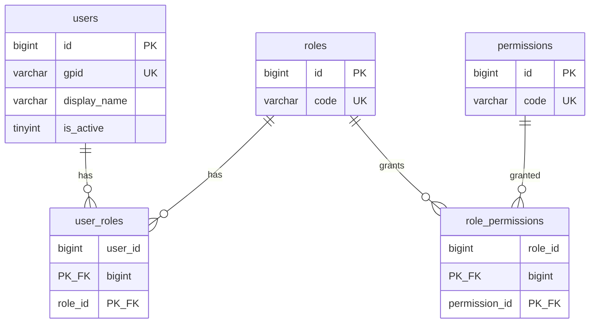
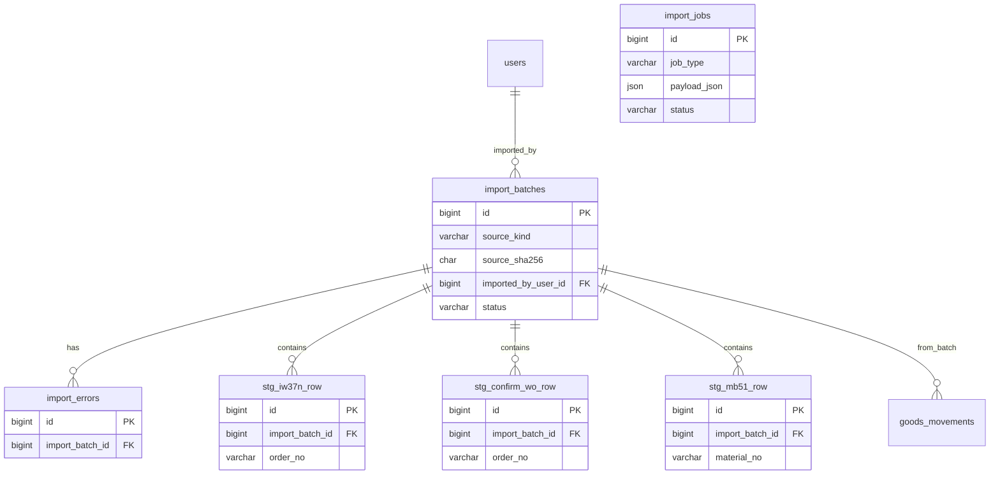
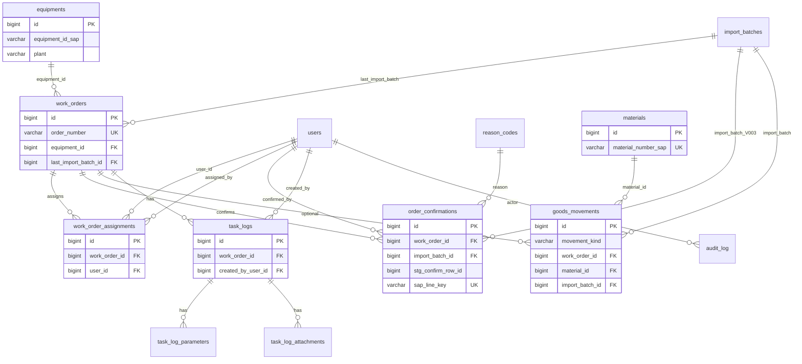
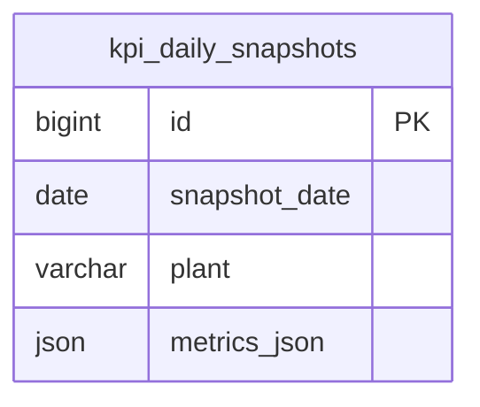

# ER diagram — `pepsi_pm` (physical / repo)

แผนภาพ **ตรงกับ DDL** ใน [`database/migrations/V001__initial_schema.sql`](../database/migrations/V001__initial_schema.sql) และการขยาย [**V003**](../database/migrations/V003__import_jobs_oc_sync_dedupe.sql) (`order_confirmations` + `import_jobs` + index)

**คู่กับ:** [`DATABASE_DESIGN_DRAFT.md`](DATABASE_DESIGN_DRAFT.md) §8–§9 (เชิงตรรกะ) · [`PROGRAM_FLOW.md`](PROGRAM_FLOW.md)

**สัญลักษณ์ flowchart (ลำดับงาน):** ดู [`PROGRAM_FLOW.md`](PROGRAM_FLOW.md) §0

---

## 0. คีย์สัญลักษณ์ (ER Diagram / Mermaid `erDiagram`)

แผนภาพใช้ **Mermaid `erDiagram`** ให้สอด **ความสัมพันธ์แบบ Crow’s foot** (ความหมายเชิง cardinality ระหว่าง entity) และบล็อก **attributes** ต่อตาราง

### 0.1 ความสัมพันธ์ (เส้นเชื่อม)

รูปแบบหลักคือ `first-entity กลุ่มแรก -- กลุ่มที่สอง second-entity : relationship-label` ตาม [Entity Relationship Diagrams — Mermaid](https://mermaid.js.org/syntax/entityRelationshipDiagram.html) โดย `relationship` แบ่งเป็น **สามส่วน**:

1. **Cardinality ของ entity แรก** (เทียบกับ entity ที่สอง) — สัญลักษณ์ชิด **entity แรก**
2. **เส้นทึบ `--` หรือเส้นประ `..`** — identifying / non-identifying (ในเอกสารนี้ใช้ `--` เป็นหลัก)
3. **Cardinality ของ entity ที่สอง** (เทียบกับ entity แรก) — สัญลักษณ์ชิด **entity ที่สอง**

**อ่านแบบใช้งานจริง (สอดกับตัวอย่างใน repo):** สำหรับ `A กลุ่มแรก -- กลุ่มที่สอง B` มักสรุปได้ว่า **กลุ่มแรก** บอกว่าแต่ละแถวของ **B** อ้างถึง **A** ได้กี่แถว และ **กลุ่มที่สอง** บอกว่าแต่ละแถวของ **A** มีแถว **B** ได้กี่แถว

| คู่สัญลักษณ์ (ชิด entity แรก / ชิด entity ที่สอง) | ความหมาย (ตามตาราง Mermaid) |
|-----------------------------------------------|------------------------------|
| `\|o` … `o\|` | ศูนย์หรือหนึ่ง (0..1) |
| `\|\|` … `\|\|` | หนึ่งพอดี (1) |
| `}o` … `o{` | ศูนย์หรือมาก (0..N) |
| `}\|` … `\|{` | หนึ่งหรือมาก (1..N) |

ค่าที่เขียนจริงอาจผสมคู่จากแถวต่างกันได้ (เช่น `\|\|` ชิด `A` คู่กับ `o{` ชิด `B`)

**ตัวอย่างที่ใช้ในเอกสารนี้**

| รูปแบบ | อ่านสั้น ๆ |
|--------|------------|
| `A \|\|--o{ B` | แต่ละ **B** อ้าง **A** พอดีหนึ่งแถว; แต่ละ **A** มี **B** ศูนย์หรือหลายแถว (1:N ทั่วไป) |
| `A \|\|--\|\| B` | แต่ละฝั่งอ้างอีกฝั่งพอดีหนึ่ง (1 — 1) |

**ป้ายบนเส้น (`: has`, `: FK`, …):** อธิบายความสัมพันธ์ **จากมุม entity แรก** (ตาม Mermaid) — ไม่ใช่ชื่อ constraint ใน DDL โดยตรง

### 0.2 คอลัมน์ในกรอบ entity

| คำต่อท้ายชนิด | ความหมาย |
|----------------|----------|
| `PK` | Primary key |
| `FK` | Foreign key (อ้างตารางอื่น) |
| `UK` | Unique (ข้อจำกัด unique) |
| `PK_FK` | เป็นทั้ง PK ของตารางเชื่อม (junction) และ FK ไปตารางอื่น |

**หมายเหตุ:** รายการคอลัมน์ในแผนภาพเป็น **ตัวอย่างสำคัญ** — ไม่ครบทุกคอลัมน์ใน DDL; รายละเอียดเต็มอยู่ใน migration

---

## 1. RBAC และผู้ใช้

---

## 2. Import pipeline — batch, staging, errors, jobs

หมายเหตุ: **`import_jobs`** ไม่มี FK ไป `import_batches` — payload เก็บ `batchId` เป็น JSON  
**`order_confirmations.import_batch_id`** (V003) แสดงในแผนภาพ §3 — FK ไป `import_batches`

---

## 3. Operational core — ใบงาน, confirm, GI/GR, master

---

## 4. KPI snapshot (F09)

Unique: `(snapshot_date, plant)` — เติมจาก job `kpi_snapshot` หรือ batch ภายหลัง

---

## 5. สรุป cardinality สำคัญ

| จาก | ไป | ความสัมพันธ์ |
|------|-----|----------------|
| `import_batches` | `stg_*` | 1 — N (ลบ batch แล้ว staging cascade) |
| `import_batches` | `import_errors` | 1 — N |
| `work_orders` | `order_number` | unique — normalize = upsert |
| `order_confirmations` | `sap_line_key` | unique (V003) — dedupe บรรทัด SAP |
| `goods_movements` | `import_batch_id` | N — 1; normalize GI/GR ลบแล้ว insert ใหม่ต่อ batch |

---

## 6. เวอร์ชันเอกสาร

| เวอร์ชัน | วันที่ | เปลี่ยนแปลง |
|----------|--------|-------------|
| 1.1 | 2026-05-04 | เพิ่ม §0 คีย์สัญลักษณ์ ER (cardinality + PK/FK/UK) สอดสไตล์ `PROGRAM_FLOW` §0; ลิงก์ไป flowchart legend |
| 1.0 | 2026-05-04 | ร่างแรก: RBAC, import+staging, operational, KPI; สอด V001+V003 |
