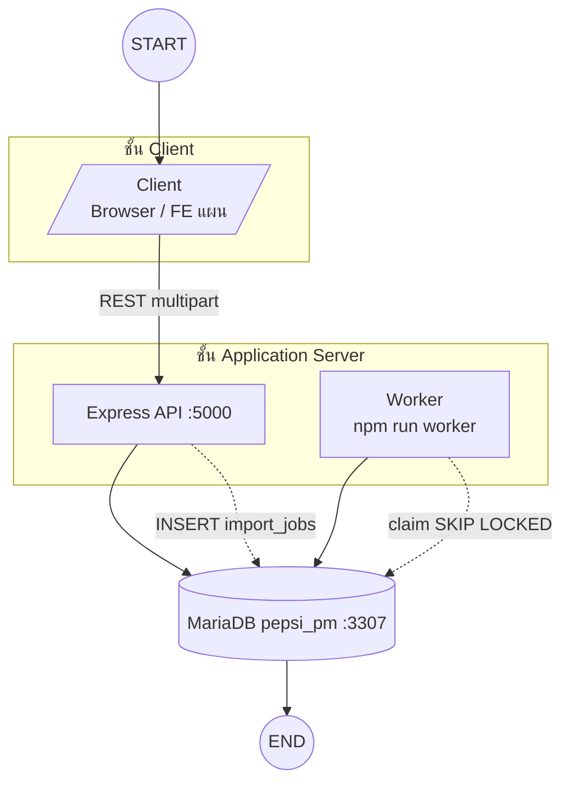
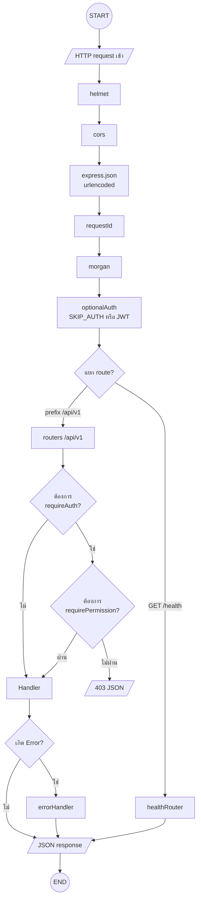
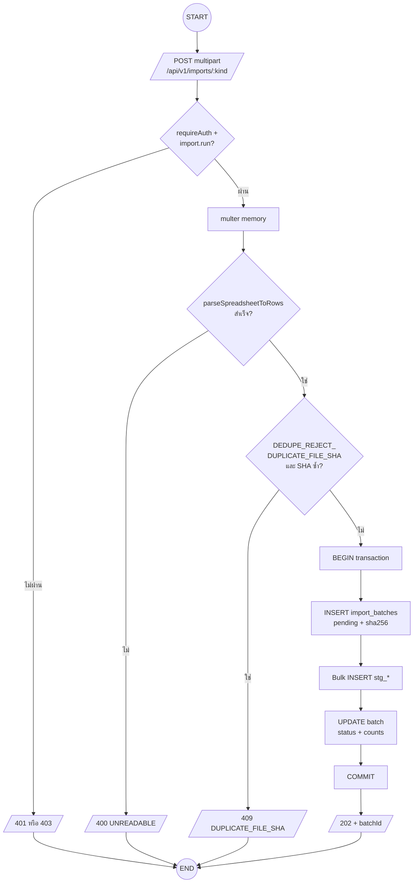
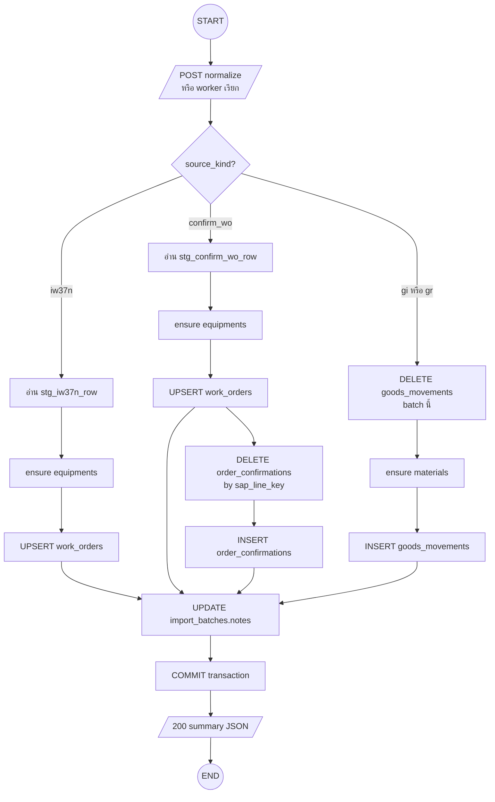
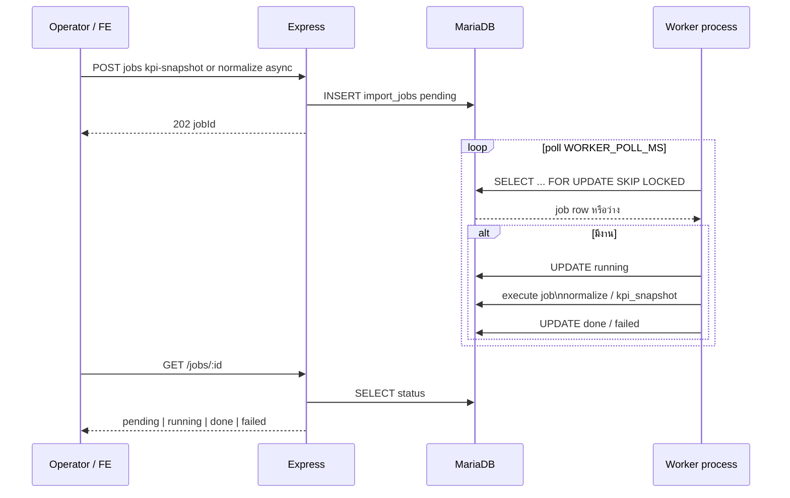
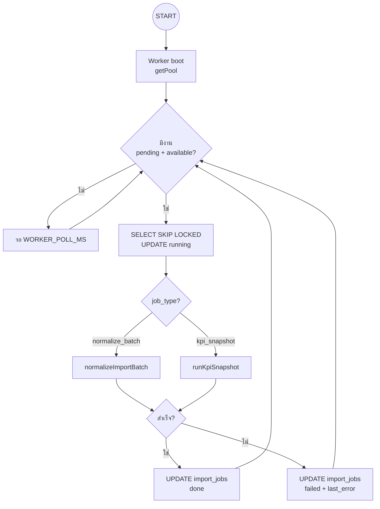
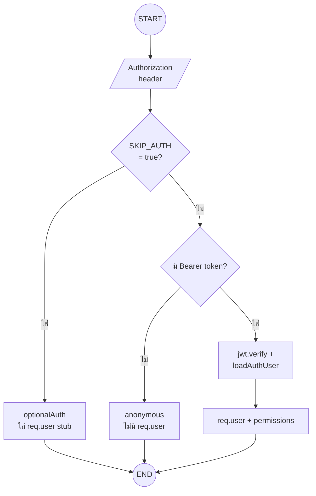

# Program flow — Pepsi PM (repo ปัจจุบัน)

เอกสารนี้สรุป **ลำดับการทำงานหลัก** ของแอปตามโค้ด backend + แผน frontend ใน repo — ไม่ใช่ SRS ฉบับลูกค้าแต่เป็น **technical flow** สำหรับทีมพัฒนา

**อ้างอิง:** [`BACKEND_STRUCTURE.md`](BACKEND_STRUCTURE.md) · [`api/openapi.yaml`](api/openapi.yaml) · [`ER_DIAGRAM.md`](ER_DIAGRAM.md) · [`DATABASE_DESIGN_DRAFT.md`](DATABASE_DESIGN_DRAFT.md)

---

## 0. คีย์สัญลักษณ์ (Flowchart)

แผนภาพใช้ **Mermaid `flowchart`** ให้สอด **สัญลักษณ์ทาง flow แบบทั่วไป** (เทียบ ANSI / ตำรา flowchart):

| รูปร่างใน Mermaid | สัญลักษณ์ | ความหมาย |
|-------------------|-----------|-----------|
| `((ข้อความ))` | **วงรี (Terminator)** | จุดเริ่ม **START** / จุดจบ **END** |
| `[/ ข้อความ /]` | **สี่เหลี่ยมด้านเฉียง (Input/Output)** | ข้อมูลเข้า–ออก เช่น HTTP, multipart, JSON response |
| `[ข้อความ]` | **สี่เหลี่ยม (Process)** | ประมวลผล / คำสั่ง / middleware / ฟังก์ชัน |
| `{ข้อความ?}` | **สี่เหลี่ยมขนมเปียกปู (Decision)** | เงื่อนไข ใช่/ไม่ใช่, แยกสาขา |
| `[(ข้อความ)]` | **ทรงกระบอก (Data store)** | ฐานข้อมูล / ที่เก็บข้อมูลถาวร |
| `subgraph` | **กรอบกลุ่ม** | ชั้นระบบหรือกลุ่มโปรเซส |

**อักขระเสริม (บนลูกศร):** ป้ายกำกับสาย เช่น `|yes|` `|REST|` = เงื่อนไขหรือชนิดข้อมูลที่ไหลผ่าน

**หมายเหตุ:** แผนภาพแบบ `sequenceDiagram` (§5) ใช้ **UML sequence** (เส้นชีวิต + ข้อความ) — ไม่ใช่ flowchart แต่แสดงลำดับเวลาเดียวกัน; ด้านล่างมี **flowchart คู่ขนาน** สำหรับ worker

---

## 1. ภาพรวมชั้นระบบ

- **HTTP:** ผู้ใช้ / FE เรียก API เท่านั้น  
- **Worker:** ดึงงานจากตาราง `import_jobs` — ไม่รับ HTTP โดยตรง

---

## 2. HTTP request (middleware chain)

ลำดับจริงอยู่ที่ [`backend/src/app.ts`](../backend/src/app.ts)

---

## 3. นำเข้าไฟล์ SAP → staging

ชนิด `kind` แยก staging: `iw37n` → `stg_iw37n_row`, `confirm_wo` → `stg_confirm_wo_row`, `gi`/`gr` → `stg_mb51_row`

---

## 4. Normalize batch → ตาราง operational

ทาง **sync:** `POST /api/v1/import-batches/:id/normalize`  
ทาง **async:** `POST .../normalize/async` หรือ `POST /api/v1/jobs/normalize-batch` → worker เรียก logic เดียวกัน

ทั้งกระบวนการอยู่ใน **transaction เดียว** — ถ้า error ระหว่างทาง service จะ **ROLLBACK** แล้วส่งต่อไป `errorHandler` (ไม่วิ่งมาถึง `OK` ในแผนภาพนี้)

หมายเหตุ: **Worker loop (§5.2)** ไม่มี `END` — รันต่อเนื่องจนกว่าจะหยุดโปรเซส

---

## 5. Worker กับคิว KPI

### 5.1 UML sequence (ลำดับเวลา)

### 5.2 Flowchart สัญลักษณ์เดียวกับ §0 (Worker loop)

---

## 6. Auth (JWT) แบบย่อ

รับ token dev: `POST /api/v1/auth/dev-token` (เมื่อไม่ใช่ production) — ดู [`BACKEND_STRUCTURE.md`](BACKEND_STRUCTURE.md) §4

---

## 7. แผน frontend (อ้างอิงเท่านั้น)

โค้ด FE ยังไม่ใน repo — flow ที่วางไว้: หน้า import → API upload → แสดง batch → กด normalize (sync หรือ async) → ดู work orders / dashboard — ดู [`FRONTEND_STRUCTURE.md`](FRONTEND_STRUCTURE.md) §3–5

---

## 8. เวอร์ชันเอกสาร

| เวอร์ชัน | วันที่ | เปลี่ยนแปลง |
|----------|--------|-------------|
| 1.0 | 2026-05-04 | ร่างแรก: ภาพรวม, HTTP, import, normalize, worker, auth |
| 1.1 | 2026-05-04 | คีย์สัญลักษณ์ §0; ปรับทุก flowchart เป็น terminator / I-O / process / decision / DB |
