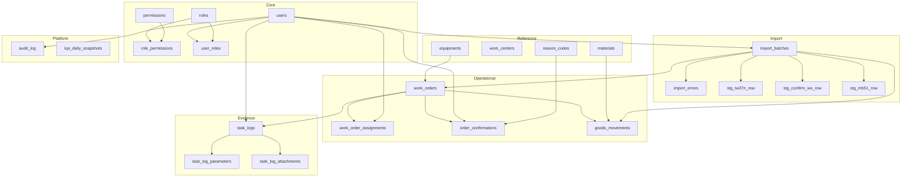

# โครงสร้างโปรเจกต์และฐานข้อมูล (ละเอียด + tree view)

เอกสารนี้สรุป **โครงสร้างโฟลเดอร์ใน repo** และ **โครงสร้าง MariaDB `pepsi_pm`** แบบ tree — **Frontend:** [`FRONTEND_STRUCTURE.md`](FRONTEND_STRUCTURE.md) · **Backend API:** [`BACKEND_STRUCTURE.md`](BACKEND_STRUCTURE.md) + [`../backend/`](../backend/) — **Program flow / ER (Mermaid):** [`PROGRAM_FLOW.md`](PROGRAM_FLOW.md), [`ER_DIAGRAM.md`](ER_DIAGRAM.md) — รายละเอียดออกแบบ DB อยู่ที่ [`DATABASE_DESIGN_DRAFT.md`](DATABASE_DESIGN_DRAFT.md); DDL อยู่ที่ [`database/migrations/V001__initial_schema.sql`](../database/migrations/V001__initial_schema.sql)

---

## 1. Repository — tree view (หัวข้อหลัก)

โฟลเดอร์รากคือ workspace โปรเจกต์ (เช่น `2020/`) ไม่ได้แสดงทุกไฟล์ใน `from customer/` เพื่อความอ่านง่าย

```
.
├── backend/                       # Node + Express API พอร์ต 5000 — ดู BACKEND_STRUCTURE.md + backend/README.md
├── frontend/                      # Vite+React+antd (พอร์ต 3000) — ดู FRONTEND_STRUCTURE.md, `npm run dev`
├── database/
│   ├── README.md                    # ชื่อฐานล็อก pepsi_pm + คำสั่ง mysql
│   └── migrations/
│       └── V001__initial_schema.sql # CREATE DATABASE + ตาราง + seed
├── docs/
│   ├── CUSTOMER_FROM_FOLDER_MANIFEST.md
│   ├── DATABASE_DESIGN_DRAFT.md
│   ├── INFRASTRUCTURE.md
│   ├── INSTALL_SOP_TAILSCALE_DOCKER.md
│   ├── PROJECT_PLAN.md
│   ├── SOFTWARE_DESIGN_DOCUMENT.md  # SDD ฉบับละเอียด
│   ├── PROJECT_STRUCTURE.md         # เอกสารนี้
│   ├── FRONTEND_STRUCTURE.md        # tree + แนวทาง React/Vite
│   ├── BACKEND_STRUCTURE.md         # tree API + middleware
│   ├── PROGRAM_FLOW.md              # Mermaid: HTTP, import, normalize, worker
│   ├── ER_DIAGRAM.md                # Mermaid: ER ตาม V001 + V003
│   ├── MEDIA_WEBP_POLICY.md         # รูปหลักฐาน → WebP ก่อนบันทึก
│   ├── api/
│   │   └── openapi.yaml             # สัญญา REST ร่าง
│   ├── SAP_DATA_IMPORT_EXPORT_COLUMNS.md
│   ├── SRS_PEPSI_DOCX_REVISION_*.md
│   ├── SRS_TABLE_3_2.md
│   └── Software Requirement Specification Pepsi Cola PM Project.docx
├── from customer/                  # แหล่งล็อกความต้องการ + ตัวอย่าง SAP
│   ├── PM Application Requirement*.docx
│   ├── requirement_13_02_63 (003).docx
│   ├── *.xlsx / *.pptx / …
│   ├── SAP data/
│   │   ├── Data/                   # export SAP (IW37N, Confirm, GI/GR, …)
│   │   └── Jul/
│   ├── server/                     # สเปกเซิร์ฟเวอร์ / Docker
│   ├── Test/
│   └── tools/
└── scripts/
    ├── build_srs_pepsi_item_revision_md.py
    ├── extract_sap_data_columns.py
    └── …
```

### 1.1 บทบาทโฟลเดอร์ (สรุป)

| Path | บทบาท |
|------|--------|
| `backend/` | **API** Node.js + Express (พอร์ต **5000**); โครง + middleware: [`BACKEND_STRUCTURE.md`](BACKEND_STRUCTURE.md), [`../backend/README.md`](../backend/README.md) |
| `frontend/` | **แผน** — แอป React (พอร์ต 3000); โครงละเอียด: [`FRONTEND_STRUCTURE.md`](FRONTEND_STRUCTURE.md) |
| `database/` | Migration, ชื่อฐานล็อก, คำสั่งรัน MariaDB |
| `docs/api/` | OpenAPI ร่าง — [`api/openapi.yaml`](api/openapi.yaml) |
| `docs/` | SRS Pepsi, แผนงาน, ออกแบบ DB/FE, คอลัมน์ SAP, คู่มือติดตั้ง |
| `from customer/` | เอกสารลูกค้า + ตัวอย่างข้อมูล SAP — **ยึดเป็นแหล่งความจริงของ requirement** |
| `from customer/SAP data/` | ไฟล์ export ใช้สร้าง [`SAP_DATA_IMPORT_EXPORT_COLUMNS.md`](SAP_DATA_IMPORT_EXPORT_COLUMNS.md) |
| `scripts/` | สคริปต์ช่วยสกัดคอลัมน์ / สร้างเอกสารจาก `.docx` |

---

## 2. ฐานข้อมูล `pepsi_pm` — tree view ตามชั้น (logical layers)

```
pepsi_pm                          CHARACTER SET utf8mb4 / utf8mb4_unicode_ci
│
├── [Core — ผู้ใช้และสิทธิ์]
│   ├── users
│   ├── roles
│   ├── permissions
│   ├── role_permissions
│   └── user_roles
│
├── [Config]
│   └── reason_codes
│
├── [Reference — master จาก SAP]
│   ├── equipments
│   ├── work_centers
│   └── materials
│
├── [Import platform]
│   ├── import_batches
│   ├── import_errors
│   ├── stg_iw37n_row              # staging IW37N
│   ├── stg_confirm_wo_row         # staging Confirm WO
│   └── stg_mb51_row               # staging GI/GR / MB51-style
│
├── [Operational — ใบงานและ workflow]
│   ├── work_orders
│   ├── work_order_assignments
│   └── order_confirmations
│
├── [Movement — GI/GR normalized]
│   └── goods_movements
│
├── [Evidence — handheld / หลักฐาน]
│   ├── task_logs
│   ├── task_log_parameters
│   └── task_log_attachments
│
└── [Platform / aggregate]
    ├── audit_log
    └── kpi_daily_snapshots
```

---

## 3. ตารางละเอียด — tree คอลัมน์ (ตาม V001)

รูปแบบ: `คอลัมน์` (ชนิดหลัก) — รายละเอียดชนิดเต็มอยู่ในไฟล์ SQL

### 3.1 `users`

```
users
├── id                    BIGINT PK AI
├── gpid                  VARCHAR(64) UK
├── display_name          VARCHAR(255)
├── email                 VARCHAR(255) NULL
├── is_active             TINYINT(1)
├── created_at            DATETIME(3)
└── updated_at            DATETIME(3)
```

### 3.2 `roles` · `permissions` · `role_permissions` · `user_roles`

```
roles
├── id · code UK · label

permissions
├── id · code UK · label NULL

role_permissions                    (PK: role_id + permission_id)
├── role_id              → roles.id
└── permission_id        → permissions.id

user_roles                          (PK: user_id + role_id)
├── user_id              → users.id
├── role_id              → roles.id
├── valid_from           DATE NULL
└── valid_until          DATE NULL
```

### 3.3 `reason_codes`

```
reason_codes
├── id · code UK
├── label_th · label_en
├── sort_order
├── requires_when_status VARCHAR(128) NULL
└── is_active
```

### 3.4 `equipments` · `work_centers` · `materials`

```
equipments                          UK (equipment_id_sap, plant)
├── id
├── equipment_id_sap · functional_location · description
├── plant · synced_at · created_at · updated_at

work_centers                        UK (work_center_code, plant)
├── id · work_center_code · plant · description
├── synced_at · created_at · updated_at

materials                           UK (material_number_sap)
├── id · material_number_sap · description · base_uom · barcode_hint
└── created_at · updated_at
```

### 3.5 `import_batches` · `import_errors`

```
import_batches
├── id
├── source_kind · source_file_name · source_sha256 NULL
├── imported_by_user_id  → users.id NULL
├── started_at · finished_at NULL
├── status · row_count_accepted · row_count_rejected
└── notes NULL

import_errors
├── id
├── import_batch_id      → import_batches.id
├── source_row_number · error_code · error_message · raw_excerpt
```

### 3.6 `stg_iw37n_row` (IW37N flat + JSON)

```
stg_iw37n_row
├── id · import_batch_id → import_batches · source_row_number
├── s_flag · mnt_plan · order_no · type · mat
├── bsc_start · act_finish · system_status · op_ac
├── operation_short_text · c_check · op_work_ctr · work · act_work · un_val
├── description · equipment · equipment_descriptn
├── functional_location · funct_loc_descrip
├── row_payload          JSON NULL
└── created_at
```

### 3.7 `stg_confirm_wo_row`

```
stg_confirm_wo_row
├── id · import_batch_id · source_row_number
├── confirm_no · counter · ord_cat · order_no · posting_date
├── equipment · wk_ctr_act · act_work · un_wk_act · pg · pt_ac · created_on
├── un_col · rem_work
├── act_start_1 · act_finish_1 · act_start_2 · act_finish_2
├── ccld_conf · wk_ctr_pln · sys_status · functional_location
├── row_payload          JSON NULL
└── created_at
```

### 3.8 `stg_mb51_row` (GI/GR superset)

```
stg_mb51_row
├── id · import_batch_id · source_row_number
├── order_no · mat_doc · entry_date · po · pstng_date · doc_date
├── material_description · quantity_str · bun · amount_in_lc_str
├── crcy · mvt · cost_ctr · time_str · mat_yr · material_no
├── row_payload          JSON NULL
└── created_at
```

### 3.9 `work_orders`

```
work_orders                         UK order_number
├── id
├── order_number · order_type NULL
├── equipment_id         → equipments.id NULL
├── work_center_planned · work_center_actual (VARCHAR, not FK ใน v1)
├── system_status · user_status NULL
├── planned_start/finish · basic_start/finish NULL
├── last_import_batch_id → import_batches.id NULL
├── ui_metadata_json     JSON NULL
└── created_at · updated_at
```

### 3.10 `work_order_assignments`

```
work_order_assignments
├── id
├── work_order_id        → work_orders.id
├── user_id              → users.id
├── assigned_at · assigned_by_user_id → users NULL · unassigned_at NULL
└── role                 VARCHAR(32) default primary
```

### 3.11 `order_confirmations`

```
order_confirmations                 CHECK sync_to_sap_status IN (pending,sent,not_applicable,failed)
├── id
├── work_order_id        → work_orders.id
├── confirmed_by_user_id → users.id NULL
├── actual_start/finish NULL · actual_work_hours NULL
├── reason_code_id       → reason_codes.id NULL
├── notes · sync_to_sap_status · created_at
```

### 3.12 `goods_movements`

```
goods_movements                     CHECK movement_kind IN (GI,GR)
├── id
├── movement_kind · work_order_id → work_orders NULL
├── material_id          → materials.id
├── quantity DECIMAL(18,4)
├── posting_date · plant · storage_location NULL
├── sap_document_reference · mat_doc · mvt NULL
├── material_description · bun · amount_in_lc · crcy · cost_ctr NULL
├── entry_date · po_number · doc_date NULL
├── import_batch_id      → import_batches NULL
└── created_at
```

### 3.13 `task_logs` · `task_log_parameters` · `task_log_attachments`

```
task_logs
├── id · work_order_id   → work_orders
├── log_type · created_by_user_id → users · created_at

task_log_parameters
├── id · task_log_id     → task_logs
├── parameter_code · value_numeric · value_text · unit

task_log_attachments
├── id · task_log_id     → task_logs
├── storage_path · mime_type · byte_size NULL · created_at
    (รูปหลักฐาน: เก็บเป็นไฟล์ WebP บนดิสก์ — mime image/webp — ดู MEDIA_WEBP_POLICY.md)
```

### 3.14 `audit_log` · `kpi_daily_snapshots`

```
audit_log
├── id · entity_type · entity_id · action
├── actor_user_id        → users NULL · payload_json · created_at

kpi_daily_snapshots                 UK (snapshot_date, plant)
├── id · snapshot_date · plant · metrics_json JSON · created_at
```

---

## 4. ความสัมพันธ์หลัก (FK) — mermaid



หมายเหตุ: `work_centers` ยังไม่ FK เข้า `work_orders` ใน v1 — เก็บ WC เป็นสตริงใน `work_orders` ตาม [`DATABASE_DESIGN_DRAFT.md`](DATABASE_DESIGN_DRAFT.md)

---

## 5. Seed หลังรัน V001 (tree แนวคิด)

```
bootstrap (INSERT IGNORE)
├── users: gpid = __system__
├── roles: admin, planner, technician, viewer
├── permissions: 9 codes (work_order.*, …)
├── role_permissions: admin × ทุก permission
└── user_roles: __system__ × admin
```

---

## 6. ลิงก์ที่เกี่ยวข้อง

| เอกสาร / ไฟล์ | เนื้อหา |
|----------------|---------|
| [`DATABASE_DESIGN_DRAFT.md`](DATABASE_DESIGN_DRAFT.md) | ชั้นข้อมูล, logical v0.2, ER, F01–F12 |
| [`database/README.md`](../database/README.md) | ชื่อฐานล็อก, พอร์ต, ตัวอย่าง env |
| [`database/migrations/V001__initial_schema.sql`](../database/migrations/V001__initial_schema.sql) | DDL + seed |
| [`FRONTEND_STRUCTURE.md`](FRONTEND_STRUCTURE.md) | tree frontend แนะนำ + แมป Fxx |
| [`BACKEND_STRUCTURE.md`](BACKEND_STRUCTURE.md) | tree backend, middleware, เส้นทาง API |
| [`PROGRAM_FLOW.md`](PROGRAM_FLOW.md) | ลำดับการทำงาน (import → normalize → worker) |
| [`ER_DIAGRAM.md`](ER_DIAGRAM.md) | ER diagram ตาม DDL + V003 |
| [`api/openapi.yaml`](api/openapi.yaml) | สัญญา REST (OpenAPI 3) |
| [`../backend/README.md`](../backend/README.md) | รัน dev / env |

---

| เวอร์ชันเอกสาร | หมายเหตุ |
|----------------|----------|
| 1.0 | 2026-05-04 — tree repo + tree DB + คอลัมน์ตาม V001 |
| 1.1 | 2026-05-04 — อ้างอิง `frontend/` แผน + [`FRONTEND_STRUCTURE.md`](FRONTEND_STRUCTURE.md) |
| 1.2 | 2026-05-04 — เพิ่ม `backend/`, `docs/BACKEND_STRUCTURE.md`, `docs/api/openapi.yaml` |
| 1.3 | 2026-05-04 — เพิ่ม [`PROGRAM_FLOW.md`](PROGRAM_FLOW.md), [`ER_DIAGRAM.md`](ER_DIAGRAM.md) |
