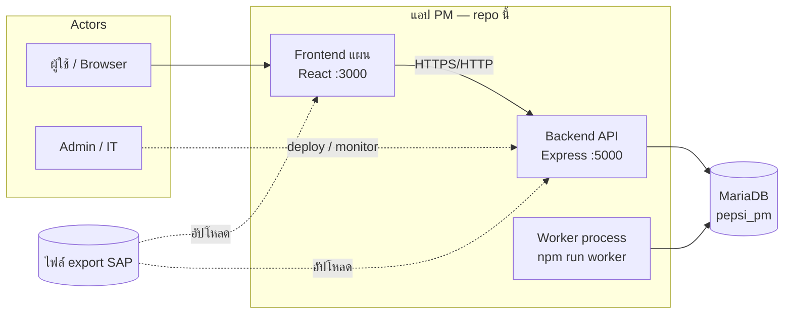
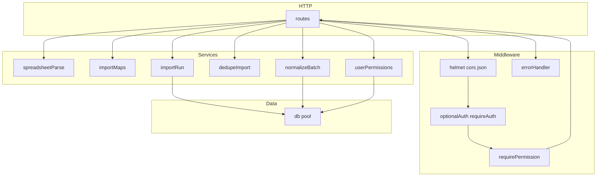
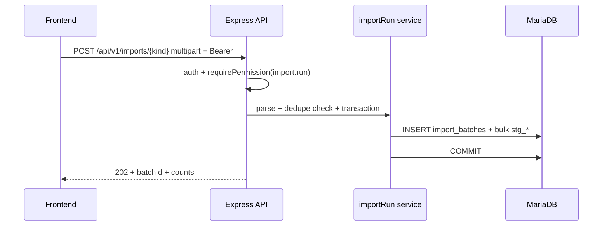
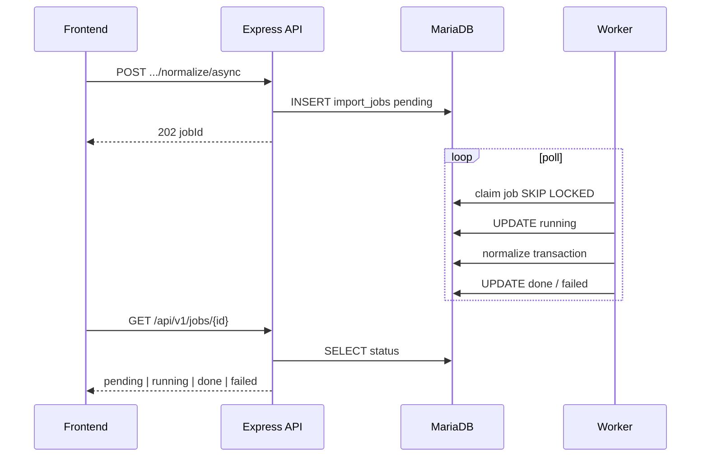
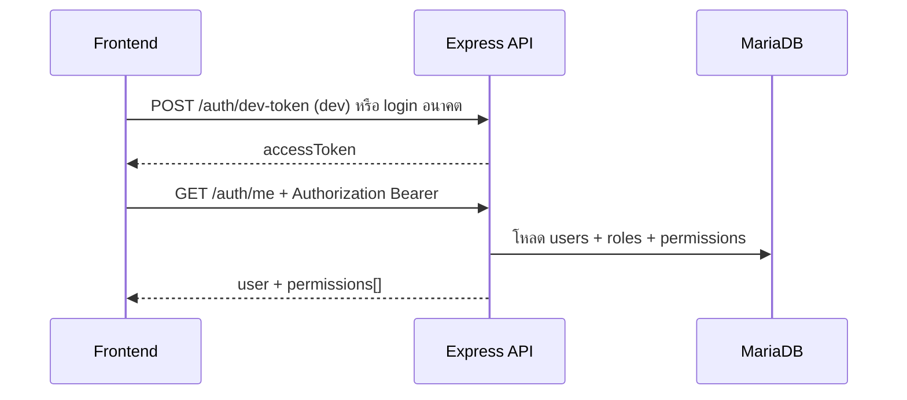

# เอกสารการออกแบบซอฟต์แวร์ (Software Design Document — SDD)

**โครงการ:** Pepsi Cola PM Application (`pepsi_pm`)  
**ชั้นที่ครอบคลุมในเอกสารนี้:** Backend ที่ implement ใน repo, ฐานข้อมูล MariaDB, สัญญา REST, คิวงานและ worker — **แผน Frontend** อ้างเท่าที่มีในเอกสารแยก (ยังไม่มีโค้ด `frontend/` ใน repo)  
**ความต้องการเชิงธุรกิจ:** ยึดชุดเอกสารลูกค้าใน `from customer/` ตาม [`PROJECT_PLAN.md`](PROJECT_PLAN.md) — SDD นี้ไม่แทนที่ SRS แต่บรรยาย **การออกแบบทางเทคนิค** ให้สอดโค้ดและ migration ปัจจุบัน

| Field | Value |
|-------|-------|
| สถานะเอกสาร | Draft — สอด repo |
| เวอร์ชัน SDD | 1.3 |
| วันที่ | 2026-05-04 |
| ผู้รับผิดชอบเอกสาร | Tech Lead (TBD) |

---

## 1. บทนำ

### 1.1 วัตถุประสงค์ของเอกสาร

- ให้ทีมพัฒนา QA และ IT ใช้ **อ้างอิงสถาปัตยกรรมและอินเทอร์เฟซ** ร่วมกัน
- เป็นฐานสำหรับ **ทบทวนการเปลี่ยนแปลง** (impact analysis) และขยายระบบ
- เชื่อมกับ **แผนโครงการ** ([`PROJECT_PLAN.md`](PROJECT_PLAN.md), [`PROJECT_PLAN_CLICKUP_FULL.md`](PROJECT_PLAN_CLICKUP_FULL.md)) และ **สัญญา API** ([`api/openapi.yaml`](api/openapi.yaml))

### 1.2 ขอบเขต (Scope of design)

| รวม | ไม่รวม (ยกเว้นระบุในเอกสารอื่น) |
|-----|-----------------------------------|
| Node.js + Express + TypeScript ที่ `backend/` | UI production ของ React (โครงใน [`FRONTEND_STRUCTURE.md`](FRONTEND_STRUCTURE.md)) |
| MariaDB schema ตาม migration `database/migrations/` | การเชื่อม SAP แบบ RFC/BAPI แบบ real-time |
| REST `/api/v1/*`, health | IdP องค์กรเต็มรูปแบบ (ระบุเป็น future ในแผน backend) |
| Import pipeline: staging → normalize → operational | รายละเอียด UI ทุกหน้าจอตาม Rev.1 (อ้าง requirement ลูกค้า) |

### 1.3 คำจำกัดความและตัวย่อ

| คำ | ความหมาย |
|-----|-----------|
| **Staging** | ตาราง `stg_*` เก็บแถวดิบหลัง parse ไฟล์ import ต่อ `import_batch_id` |
| **Normalize** | แปลงข้อมูลจาก staging ไปตาราง operational (`work_orders`, `goods_movements`, `order_confirmations`, …) ใน transaction |
| **Batch** | แถว `import_batches` หนึ่งแถวต่อการอัปโหลดไฟล์หนึ่งครั้ง (มี `source_kind`, `source_sha256`, สถานะ) |
| **Job** | แถว `import_jobs` สำหรับงาน async (normalize, kpi_snapshot) ที่ worker ดึงไปรัน |
| **WO** | Work order (`work_orders`) |
| **GM** | Goods movement (`goods_movements`) |
| **OC** | Order confirmation (`order_confirmations`) |

---

## 2. เอกสารอ้างอิง

| ประเภท | เอกสาร |
|--------|---------|
| แผนโครงการ | [`PROJECT_PLAN.md`](PROJECT_PLAN.md), [`PROJECT_PLAN_CLICKUP_FULL.md`](PROJECT_PLAN_CLICKUP_FULL.md) |
| โครง repo | [`PROJECT_STRUCTURE.md`](PROJECT_STRUCTURE.md) |
| Backend | [`BACKEND_STRUCTURE.md`](BACKEND_STRUCTURE.md), [`../backend/README.md`](../backend/README.md) |
| Flow | [`PROGRAM_FLOW.md`](PROGRAM_FLOW.md) |
| ข้อมูล | [`ER_DIAGRAM.md`](ER_DIAGRAM.md), [`DATABASE_DESIGN_DRAFT.md`](DATABASE_DESIGN_DRAFT.md), migrations `V001`, `V002`, `V003` |
| API | [`api/openapi.yaml`](api/openapi.yaml) |
| FE แผน | [`FRONTEND_STRUCTURE.md`](FRONTEND_STRUCTURE.md) |
| Infra | [`INSTALL_SOP_TAILSCALE_DOCKER.md`](INSTALL_SOP_TAILSCALE_DOCKER.md), [`INFRASTRUCTURE.md`](INFRASTRUCTURE.md) |
| คอลัมน์ SAP | [`SAP_DATA_IMPORT_EXPORT_COLUMNS.md`](SAP_DATA_IMPORT_EXPORT_COLUMNS.md) |

---

## 3. บริบทของระบบ (System context)

### 3.1 ผู้ใช้และระบบภายนอก

- **ผู้ใช้ปลายทาง:** ผู้ปฏิบัติงาน PM ผ่านเว็บแอป (พอร์ต **3000** ตามแผน) — เรียก API ที่พอร์ต **5000**
- **SAP ERP:** แหล่งข้อมูลเชิงไฟล์ (export `.xls`/`.xlsx`/TSV) — ไม่มีการออกแบบ connector แบบ online ใน SDD ฉบับนี้
- **ฐานข้อมูล:** MariaDB ชื่อ `pepsi_pm` (พอร์ตค่าเริ่มต้น dev **3307**)
- **ผู้ดูแลระบบ:** IT ลูกค้า — Docker, Tailscale, backup ตาม SOP

### 3.2 แผนภูมิบริบท (ระดับสูง)



---

## 4. ข้อจำกัดและสมมติฐาน

| ID | รายการ |
|----|--------|
| AS-01 | ลำดับ middleware และเส้นทาง API สอด [`backend/src/app.ts`](../backend/src/app.ts) และ [`BACKEND_STRUCTURE.md`](BACKEND_STRUCTURE.md) |
| AS-02 | ชื่อฐานข้อมูลล็อก `pepsi_pm` — การเปลี่ยนชื่อต้องแก้ migration + env |
| AS-03 | Auth production ออกแบบรอบ **JWT HS256** + ตาราง `users` / roles / permissions — `SKIP_AUTH` ใช้เฉพาะ dev |
| AS-04 | ไฟล์ import ประมวลผลใน **memory** (multer memoryStorage) — ขนาดสูงสุดตามที่กำหนดใน route (ดู OpenAPI / imports route) |
| AS-05 | Normalize แบบ sync ทำงานใน **request เดียว** จนกว่าจะ timeout ที่ reverse proxy — ชุดใหญ่ใช้ async + worker |

---

## 5. มุมมองสถาปัตยกรรม (Architectural view)

### 5.1 สไตล์สถาปัตยกรรม

- **Monolith แบบแยกโปรเซส:** HTTP API หนึ่งโปรเซส + **Worker** หนึ่งโปรเซสแยก — ใช้ฐานข้อมูลร่วมและตาราง `import_jobs` เป็นคิว
- **ชั้นโค้ด (layered):** Routes (HTTP) → Services (ธุรกิจ) → DB pool — ไม่ใส่ SQL ยาวใน route โดยเจตนา
- **API version:** prefix ` /api/v1/` สำหรับเส้นทางธุรกิจ; `/health` ไม่มี prefix

### 5.2 โมดูลหลักและความรับผิดชอบ

| โมดูล | Path | ความรับผิดชอบ |
|--------|------|----------------|
| Bootstrap | `server.ts`, `app.ts` | โหลด env, mount middleware, listen PORT |
| Config | `config/env.ts` | Zod validate `process.env` — fail fast ตอนบูต |
| DB | `db/pool.ts` | Connection pool mysql2/promise |
| HTTP routes | `routes/*.ts` | validation ระดับ HTTP, เรียก service, map status code |
| Services | `services/*.ts` | parse, importRun, normalizeBatch, dedupe, permissions |
| Jobs | `jobs/*.ts` | สร้าง/claim/update `import_jobs`, dispatch normalize / KPI |
| Worker | `worker/runner.ts` | Poll `WORKER_POLL_MS`, claim `SKIP LOCKED`, execute job |
| Middleware | `middleware/*.ts` | security, auth, RBAC, error, requestId |

### 5.3 ไดอะแกรมการพึ่งพาภายใน (โปรเซส API)



---

## 6. สแต็กเทคโนโลยี

| ชั้น | เทคโนโลยี | หมายเหตุ |
|------|-----------|----------|
| Runtime | Node.js (LTS ตาม `engines` ใน `backend/package.json`) | |
| ภาษา | TypeScript | compile เป็น JS สำหรับรัน |
| HTTP | Express 4.x | |
| DB driver | mysql2 / promise pool | |
| Validation env | Zod | `env.ts` |
| Auth token | jsonwebtoken | HS256 |
| Upload | multer 2.x (memory) | จำกัดขนาดไฟล์ |
| Spreadsheet | xlsx + TSV fallback | `spreadsheetParse.ts` |
| API spec | OpenAPI 3.0 | `docs/api/openapi.yaml` |
| FE แผน | React 18 + Vite + TS | ดู FRONTEND_STRUCTURE |

---

## 7. การกำหนดค่าและสภาพแวดล้อม (Configuration)

### 7.1 ตัวแปรสภาพแวดล้อม (สรุปจาก `env.ts`)

| ตัวแปร | ค่าเริ่มต้น / กฎ | ความหมาย |
|--------|------------------|-----------|
| `NODE_ENV` | development | ควบคุม dev-token และพฤติกรรมบางอย่าง |
| `PORT` | 5000 | พอร์ต HTTP API |
| `DATABASE_HOST` | 127.0.0.1 | MariaDB host |
| `DATABASE_PORT` | 3307 | พอร์ต DB |
| `DATABASE_USER` / `DATABASE_PASSWORD` / `DATABASE_NAME` | root / "" / pepsi_pm | credential |
| `CORS_ORIGIN` | http://127.0.0.1:3000 | origin ที่อนุญาต |
| `SKIP_AUTH` | false | true = stub user + ข้าม RBAC สำหรับ dev |
| `JWT_SECRET` | required if not SKIP_AUTH | ความยาว ≥ 16 |
| `JWT_EXPIRES_IN` | 8h | อายุ token |
| `DEV_AUTH_SECRET` | optional | สำหรับ `POST /auth/dev-token` |
| `DEDUPE_REJECT_DUPLICATE_FILE_SHA` | false | true = ปฏิเสธอัปโหลดเมื่อ SHA+kind ซ้ำ |
| `WORKER_POLL_MS` | ≥200, default 2000 | ช่วง poll ของ worker |

### 7.2 พอร์ตและโปรโตคอล (ภาคผนวกค)

| บริการ | พอร์ต (แผน) |
|--------|-------------|
| Frontend | 3000 |
| Backend API | 5000 |
| MariaDB | 3307 |

---

## 8. การออกแบบข้อมูล (Data design)

### 8.1 กลยุทธ์การ migrate

- ใช้ **Flyway-style** ไฟล์ `V00n__description.sql` ตามโฟลเดอร์ `database/migrations/`
- **V001:** schema หลัก `pepsi_pm` + ตาราง core, staging, operational
- **V002:** ผู้ใช้ demo / seed ที่เกี่ยวกับ auth dev
- **V003:** `import_jobs`, คอลัมน์ OC sync + index `sap_line_key` — ดู [`ER_DIAGRAM.md`](ER_DIAGRAM.md)

### 8.2 กลุ่มตาราง (logical)

| กลุ่ม | ตารางตัวอย่าง | บทบาท |
|--------|----------------|--------|
| RBAC | `users`, `roles`, `permissions`, `user_roles`, `role_permissions` | ล็อกอินและสิทธิ์ |
| Import control | `import_batches`, `import_errors`, `import_jobs` | ติดตามการนำเข้าและคิว |
| Staging | `stg_iw37n_row`, `stg_confirm_wo_row`, `stg_mb51_row` | เก็บแถวดิบ |
| Master | `equipments`, `materials`, `reason_codes` | อ้างอิง WO/GM/Confirm |
| Operational | `work_orders`, `work_order_assignments`, `order_confirmations`, `goods_movements`, `task_logs`, … | ข้อมูลใช้งาน |
| Reporting | `kpi_daily_snapshots` | KPI materialized |

รายละเอียดคอลัมน์และ ER: [`ER_DIAGRAM.md`](ER_DIAGRAM.md), [`DATABASE_DESIGN_DRAFT.md`](DATABASE_DESIGN_DRAFT.md)

### 8.3 กฎความสอดคล้องสำคัญ (ออกแบบ)

- **`order_confirmations.sap_line_key`:** unique — dedupe บรรทัด SAP ต่อ V003
- **`import_jobs`:** สถานะ `pending` → `running` → `done` | `failed`; claim ด้วย `FOR UPDATE SKIP LOCKED` เพื่อหลาย worker ในอนาคต
- **Normalize ใน transaction เดียว:** ถ้า error ระหว่างทาง rollback — สอด [`PROGRAM_FLOW.md`](PROGRAM_FLOW.md)

---

## 9. การออกแบบ API (Interface design)

### 9.1 หลักการ

- **JSON** เป็นสื่อกลาง response error มาตรฐานผ่าน `errorHandler`
- **`X-Request-Id`:** สะท้อนใน body error เพื่อ trace
- **Auth:** header `Authorization: Bearer <JWT>` เมื่อ `SKIP_AUTH=false`
- **สิทธิ์:** string permission เช่น `import.run`, `report.dashboard` — map จาก DB

### 9.2 ตารางเส้นทางหลัก (สรุป — รายละเอียดใน OpenAPI)

| Method | Path | สิทธิ์ / หมายเหตุ |
|--------|------|-------------------|
| GET | `/health` | public |
| GET | `/api/v1/health` | public |
| POST | `/api/v1/auth/dev-token` | dev only; header `X-Dev-Auth-Secret` |
| GET | `/api/v1/auth/me` | authenticated |
| POST | `/api/v1/imports/:kind` | `import.run`; multipart; `kind` ∈ iw37n, confirm_wo, gi, gr |
| GET | `/api/v1/import-batches` | list/filter batches |
| GET | `/api/v1/import-batches/:id/errors` | errors ของ batch |
| POST | `/api/v1/import-batches/:id/normalize` | sync normalize |
| POST | `/api/v1/import-batches/:id/normalize/async` | คิว normalize |
| POST | `/api/v1/jobs/normalize-batch` | body `batchId`; คิว normalize |
| POST | `/api/v1/jobs/kpi-snapshot` | `report.dashboard`; คิว KPI |
| GET | `/api/v1/jobs/:id` | สถานะ job |
| GET | `/api/v1/work-orders` | ตัวอย่าง list WO |

### 9.3 รหัส HTTP ที่ออกแบบไว้ (ตัวอย่าง)

| สถานการณ์ | HTTP | หมายเหตุ |
|------------|------|----------|
| อัปโหลดสำเร็จ | 202 | Accepted + `batchId` |
| ไฟล์อ่านไม่ได้ | 400 | `UNREADABLE` |
| ไฟล์ใหญ่เกิน multer | 413 | Multer `LIMIT_FILE_SIZE` |
| SHA ซ้ำเมื่อเปิด dedupe | 409 | `DUPLICATE_FILE_SHA` |
| ไม่มีสิทธิ์ | 403 | RBAC |
| ไม่มี token เมื่อต้อง auth | 401 | |
| ภายใน server | 500 | log พร้อม `requestId` |

---

## 10. การออกแบบกระบวนการ (Process design)

### 10.1 Import → Staging

1. รับ multipart → multer buffer  
2. `parseSpreadsheetToRows` — xlsx หรือ TSV  
3. ตรวจ `DEDUPE_REJECT_DUPLICATE_FILE_SHA` กับ `import_batches` เดิม  
4. `BEGIN` → insert `import_batches` (pending) → bulk `stg_*` → update counts/status → `COMMIT`  
5. แถวผิด map ลง `import_errors`

อ้าง flowchart ใน [`PROGRAM_FLOW.md`](PROGRAM_FLOW.md) หมวด 3

### 10.2 Normalize (sync)

1. ตรวจสิทธิ์และ ownership ของ batch  
2. แยกสาขา `source_kind`:  
   - `iw37n` / `confirm_wo`: ensure equipments → upsert `work_orders`; ถ้า confirm → ลบ/insert `order_confirmations` ตามกฎ `sap_line_key`  
   - `gi` / `gr`: ลบ GM ของ batch → ensure materials → insert GM  
3. อัปเดต `import_batches.notes` / สถานะ  
4. `COMMIT` — ถ้า throw → rollback + `errorHandler`

อ้าง [`PROGRAM_FLOW.md`](PROGRAM_FLOW.md) หมวด 4

### 10.3 Async job + Worker

1. HTTP insert `import_jobs` (`pending`, `job_type`, `payload_json`)  
2. Worker poll → `SELECT … FOR UPDATE SKIP LOCKED` → `running`  
3. Dispatch `normalize_batch` | `kpi_snapshot`  
4. อัปเดต `done` | `failed` + `last_error`  
5. Client poll `GET /jobs/:id`

อ้าง [`PROGRAM_FLOW.md`](PROGRAM_FLOW.md) หมวด 5

---

## 11. การออกแบบความปลอดภัย (Security design)

| หัวข้อ | การออกแบบ |
|--------|-----------|
| Transport | แนะนำ TLS ที่ reverse proxy ใน production — ออกแบบแอปรับ trust จาก proxy ตามที่ deploy |
| AuthN | JWT HS256; sub อ้าง `users.id` |
| AuthZ | `requirePermission(code)` เทียบ `req.user.permissions` จาก DB |
| Dev bypass | `SKIP_AUTH` และ `dev-token` **ต้องปิด**ใน production (`NODE_ENV=production`) |
| Secret | `JWT_SECRET`, `DEV_AUTH_SECRET`, `DATABASE_PASSWORD` — ไม่ commit; ใช้ `.env` / secret manager |
| CORS | whitelist `CORS_ORIGIN` |
| Upload | จำกัดขนาด; ไม่รัน executable จากไฟล์อัปโหลด |

---

## 12. การจัดการข้อผิดพลาดและล็อก (Error handling & logging)

### 12.1 Error handler

- `multer.MulterError` → 400 หรือ 413 พร้อม `err.code`  
- Error ที่มี `status` number → ใช้เป็น HTTP status  
- อื่น ๆ → 500; **log console** เมื่อ status ≥ 500 พร้อม `requestId`

อ้าง [`backend/src/middleware/errorHandler.ts`](../backend/src/middleware/errorHandler.ts)

### 12.2 Request correlation

- Middleware `requestId` ใส่ `X-Request-Id` และ `req.requestId` — ใช้ trace ข้าม FE–BE–log

### 12.3 Access log

- `morgan` (หรือ wrapper ใน `logger.ts`) สำหรับ HTTP access

---

## 13. ประสิทธิภาพและขีดจำกัด (Performance)

| หัวข้อ | การออกแบบ |
|--------|-----------|
| Memory upload | ไฟล์ใหญ่ใช้ RAM มาก — กำหนด limit ชัด; พิจารณา streaming/chunk ในอนาคต |
| Bulk insert | ใช้ batch insert ลง staging ลด round-trip |
| Normalize sync | อาจใช้เวลานาน — ใช้ async job เป็นทางเลือกเมื่อข้อมูลใหญ่ |
| Worker | `WORKER_POLL_MS` ถ่วงดุล latency กับโหลด DB |
| DB index | อ้าง migration + ER สำหรับคีย์ค้นหา (`order_number`, `sap_line_key`, batch id) |

### 13.1 สื่อแนบรูปภาพ (before / after)

- `task_log_attachments` เก็บ **metadata** (`storage_path`, `mime_type`, `byte_size`); ไฟล์จริงอยู่บนดิสก์ — **ไม่** เก็บ blob ใหญ่ใน DB  
- **นโยบาย:** แปลง raster เป็น **WebP ก่อนบันทึกถาวร** เพื่อไม่ให้ storage โตเร็ว — รายละเอียด [`MEDIA_WEBP_POLICY.md`](MEDIA_WEBP_POLICY.md)  
- ไม่ใช้กับ pipeline นำเข้า SAP (spreadsheet)

---

## 14. การทดสอบ (Testing strategy — ระดับออกแบบ)

| ระดับ | เป้าหมาย |
|--------|----------|
| Unit | parser, importMaps, validation แยกส่วน |
| Integration | API + DB จริงหรือ testcontainer (ตามที่ทีมเลือก) |
| Contract | OpenAPI เป็นแหล่งความจริงร่วมกับ FE — ตรวจสอบเมื่อ merge |
| UAT | สคริปต์จาก PO/KEY ตาม [`PROJECT_PLAN_CLICKUP_FULL.md`](PROJECT_PLAN_CLICKUP_FULL.md) |

---

## 15. การ deploy และความพร้อมใช้งาน (Deployment view)

- **Dev:** รัน `node` / `tsx` + MariaDB local หรือ Docker ตาม [`INSTALL_SOP_TAILSCALE_DOCKER.md`](INSTALL_SOP_TAILSCALE_DOCKER.md)  
- **Worker:** รันแยก process `npm run worker` — ต้องมีใน production ถ้าใช้คิว async  
- **Compose รวม worker:** ระบุใน backlog backend (ดู [`BACKEND_STRUCTURE.md`](BACKEND_STRUCTURE.md) หมวดงานถัดไป)

---

## 16. แผน Frontend (สรุปการออกแบบจากเอกสาร ไม่ใช่โค้ด repo)

- โครงสร้างโฟลเดอร์ `features/*`, routes, `LoginPage`, `data-import`, `api/endpoints` — ดู [`FRONTEND_STRUCTURE.md`](FRONTEND_STRUCTURE.md)  
- สแต็กที่ล็อกในเอกสาร FE: **React + Vite + TypeScript**, **Ant Design**, **responsive** (breakpoint / Grid), **anime.js**, **Chart.js** + **Highcharts** สำหรับกราฟ  
- การเชื่อม `VITE_API_BASE_URL` → backend  
- RBAC บน UI สอด permission จาก `/auth/me`

---

## 17. Traceability — ออกแบบสอดฟีเจอร์แผน (F01–F12)

| Fxx | องค์ประกอบหลักใน SDD นี้ |
|-----|---------------------------|
| F01 | imports iw37n, staging, normalize WO |
| F02 | work-orders API + แผน FE |
| F03–F04 | imports gi/gr, staging mb51, GM |
| F05 | confirm import + OC + แผน FE confirm |
| F06–F07 | ขยาย schema/API ตาม scope — ออกแบบหลังล็อกไฟล์ |
| F08 | export endpoints + แผน sap-reports |
| F09 | jobs kpi + dashboard API/FE |
| F10 | auth middleware, permissions |
| F11 | INFRA, TLS, Tailscale |
| F12 | compose, พอร์ต 3000/5000/3307 |

---

## 18. งานออกแบบ / วิศวกรรมที่เปิด (Open design items)

- IdP องค์กร (SSO) แทน dev-token — ตาม [`BACKEND_STRUCTURE.md`](BACKEND_STRUCTURE.md)  
- Docker Compose รวม API + DB + worker สำหรับ pilot  
- Repository layer แยกจาก service ถ้าโค้ด query โตขึ้น  
- Streaming upload สำหรับไฟล์ใหญ่มาก

---

## ภาคผนวก ก — สรุป HTTP API ทุกเส้นทาง (สอด OpenAPI `info.version` และ repo)

แหล่งความจริงฉบับเต็ม: [`api/openapi.yaml`](api/openapi.yaml) — ตารางนี้ใช้สำหรับอ้างอิงเร็วและนำเข้าเอกสารอื่น

| ลำดับ | Method | Path | Auth / สิทธิ์ (เมื่อ `SKIP_AUTH=false`) | สรุป |
|-------|--------|------|------------------------------------------|------|
| 1 | GET | `/health` | ไม่ต้อง | Liveness |
| 2 | GET | `/api/v1/health` | ไม่ต้อง | Health + เวอร์ชัน API |
| 3 | POST | `/api/v1/auth/dev-token` | Header `X-Dev-Auth-Secret`; ปิดใน `NODE_ENV=production` | ออก JWT สำหรับ `gpid` ที่มีในฐาน |
| 4 | GET | `/api/v1/auth/me` | Bearer JWT (หรือ stub เมื่อ `SKIP_AUTH=true`) | ผู้ใช้ + permissions |
| 5 | POST | `/api/v1/imports/{kind}` | `import.run` | Multipart ไฟล์เดียว → staging; `kind` ∈ `iw37n`, `confirm_wo`, `gi`, `gr` |
| 6 | GET | `/api/v1/import-batches` | ตาม route (ดู implementation) | List batches + query `source_kind`, `limit`, `offset` |
| 7 | POST | `/api/v1/import-batches/{id}/normalize` | `import.run` | Normalize sync ใน request |
| 8 | POST | `/api/v1/import-batches/{id}/normalize/async` | `import.run` | คิว normalize → worker |
| 9 | GET | `/api/v1/import-batches/{id}/errors` | ตาม route | รายการ `import_errors` ของ batch |
| 10 | POST | `/api/v1/jobs/normalize-batch` | `import.run` | Body `{ batchId }` → คิว normalize |
| 11 | POST | `/api/v1/jobs/kpi-snapshot` | `report.dashboard` | Body `snapshotDate`, optional `plant` → คิว KPI |
| 12 | GET | `/api/v1/jobs/{id}` | ตาม route | สถานะ job (`pending` / `running` / `done` / `failed`) |
| 13 | GET | `/api/v1/work-orders` | ตาม route | รายการ WO แบบแบ่งหน้า (`page`, `pageSize`) |

**หมายเหตุ:** รายละเอียด request/response schema, รหัส 4xx/5xx เพิ่มเติม, และตัวอย่าง JSON อยู่ใน OpenAPI — เมื่อเพิ่ม endpoint ใหม่ให้อัปเดตทั้ง OpenAPI และตารางนี้

---

## ภาคผนวก ข — ตัวแปรสภาพแวดล้อม (ฉบับเต็มสอด `backend/src/config/env.ts`)

| ตัวแปร | ชนิด (แนวคิด) | ค่าเริ่มต้น | บังคับ / เงื่อนไข |
|--------|----------------|-------------|---------------------|
| `NODE_ENV` | string | `development` | — |
| `PORT` | number | `5000` | — |
| `DATABASE_HOST` | string | `127.0.0.1` | — |
| `DATABASE_PORT` | number | `3307` | — |
| `DATABASE_USER` | string | `root` | — |
| `DATABASE_PASSWORD` | string | `""` | production ควรตั้งจริง |
| `DATABASE_NAME` | string | `pepsi_pm` | — |
| `CORS_ORIGIN` | string | `http://127.0.0.1:3000` | ต้องตรง origin ที่ FE ใช้ |
| `SKIP_AUTH` | boolean | `false` | ถ้า `false` ต้องมี `JWT_SECRET` ความยาว ≥ 16 |
| `JWT_SECRET` | string | — | **บังคับ** เมื่อ `SKIP_AUTH=false` |
| `JWT_EXPIRES_IN` | string | `8h` | — |
| `DEV_AUTH_SECRET` | string | — | ใช้คู่กับ `POST /auth/dev-token` |
| `DEDUPE_REJECT_DUPLICATE_FILE_SHA` | boolean | `false` | `true` → 409 เมื่อ SHA+kind ซ้ำ |
| `WORKER_POLL_MS` | number | `2000` | ขั้นต่ำ 200 (ms) |

**กฎ validation:** `env.ts` ใช้ Zod — ค่าไม่ผ่านจะทำให้ process ไม่ boot (fail fast)

---

## ภาคผนวก ค — ไฟล์ migration ฐานข้อมูล (ลำดับ Flyway-style)

| ไฟล์ | เนื้อหาหลัก | ลิงก์ |
|------|-------------|------|
| `V001__initial_schema.sql` | สร้าง DB `pepsi_pm`, ตาราง RBAC, staging, operational, `kpi_daily_snapshots` | [`../database/migrations/V001__initial_schema.sql`](../database/migrations/V001__initial_schema.sql) |
| `V002__demo_user.sql` | ผู้ใช้/บทบาทตัวอย่างสำหรับ dev + `dev-token` | [`../database/migrations/V002__demo_user.sql`](../database/migrations/V002__demo_user.sql) |
| `V003__import_jobs_oc_sync_dedupe.sql` | `import_jobs`, คอลัมน์ OC/`import_batch_id`, unique `sap_line_key` | [`../database/migrations/V003__import_jobs_oc_sync_dedupe.sql`](../database/migrations/V003__import_jobs_oc_sync_dedupe.sql) |

คำสั่งรันและชื่อฐาน: [`../database/README.md`](../database/README.md)

---

## ภาคผนวก ง — รูปแบบข้อความ error ใน JSON และรหัสที่เกี่ยวข้อง

### ง.1 โครงสร้าง body ทั่วไป (ผ่าน `errorHandler`)

```json
{
  "error": { "code": "<string>", "message": "<string>" },
  "requestId": "<uuid-or-id>"
}
```

- Multer: `code` อาจเป็นรหัส Multer (เช่น `LIMIT_FILE_SIZE`) และ HTTP **413** หรือ **400**
- Error ที่มี property `status`: ใช้เป็น HTTP status
- อื่น ๆ: HTTP **500**, `code` มักเป็น `INTERNAL_ERROR`

### ง.2 รหัสที่ออกแบบจาก OpenAPI / import flow (ตัวอย่าง)

| HTTP | code / สถานการณ์ | ความหมาย |
|------|-------------------|-----------|
| 400 | `UNREADABLE` / parse fail | อ่านสเปรดชีตไม่ได้ |
| 401 | Unauthorized | ไม่มีหรือ JWT ไม่ถูกต้อง |
| 403 | Forbidden | ไม่มี permission ที่ต้องการ |
| 404 | Not found | batch/job ไม่พบ |
| 409 | `DUPLICATE_FILE_SHA` | เปิด `DEDUPE_REJECT_DUPLICATE_FILE_SHA` และไฟล์ซ้ำ |
| 413 | Multer limit | ไฟล์เกินขนาดที่กำหนด |
| 500 | `INTERNAL_ERROR` | ข้อผิดพลาดภายใน — ตรวจ log + `requestId` |

รายละเอียดเพิ่มเติมต่อ path: [`api/openapi.yaml`](api/openapi.yaml)

---

## ภาคผนวก จ — Sequence diagram เสริม (Mermaid)

### จ.1 อัปโหลดไฟล์ import (sync จนจบ HTTP)



### จ.2 Normalize แบบ async + worker



### จ.3 JWT + `/auth/me`



---

## ภาคผนวก ฉ — รายการตารางหลักใน `pepsi_pm` (อ้าง ER)

ใช้เป็นดัชนีไปยัง [`ER_DIAGRAM.md`](ER_DIAGRAM.md) และ DDL — **ไม่ทับรายละเอียดคอลัมน์ทุกตัวใน SDD**

| กลุ่ม | ตาราง |
|--------|--------|
| RBAC | `users`, `roles`, `permissions`, `user_roles`, `role_permissions` |
| Config | `reason_codes` |
| Import | `import_batches`, `import_errors`, `import_jobs` |
| Staging | `stg_iw37n_row`, `stg_confirm_wo_row`, `stg_mb51_row` |
| Master | `equipments`, `materials` |
| Operational | `work_orders`, `work_order_assignments`, `order_confirmations`, `goods_movements`, `task_logs`, `task_log_parameters`, `task_log_attachments`, `audit_log` |
| KPI | `kpi_daily_snapshots` |

---

## ภาคผนวก ช — รหัส permission, บทบาท (roles), และการผูก route

แหล่งความจริงในฐานข้อมูล: `INSERT IGNORE` ใน [`../database/migrations/V001__initial_schema.sql`](../database/migrations/V001__initial_schema.sql) (ตาราง `permissions`, `roles`, `role_permissions`) และผู้ใช้ตัวอย่าง [`../database/migrations/V002__demo_user.sql`](../database/migrations/V002__demo_user.sql)  
แหล่งความจริงในรันไทม์: [`backend/src/services/userPermissions.ts`](../backend/src/services/userPermissions.ts), [`backend/src/middleware/requirePermission.ts`](../backend/src/middleware/requirePermission.ts)

### ช.1 ตาราง `permissions.code` ทั้งหมดจาก seed (V001)

รหัสที่ลงทะเบียนในตาราง `permissions` — ใช้เป็นสตริงใน `requirePermission('…')` และใน JWT payload `/auth/me` (สำหรับผู้ใช้ที่ **ไม่**ใช่บทบาท `admin` จะได้รายการจริงจาก JOIN; ดูช.3)

| `code` (permission string) | `label` (คำอธิบายใน DB) |
|----------------------------|-------------------------|
| `work_order.view` | View work orders |
| `work_order.assign` | Assign technicians |
| `work_order.edit` | Edit scheduling fields |
| `order_confirmation.create` | Create confirmations |
| `goods_movement.view` | View GI/GR |
| `goods_movement.import` | Import GI/GR files |
| `import.run` | Run SAP file imports |
| `report.dashboard` | View dashboard / KPI |
| `admin.users` | Manage users and roles |

**หมายเหตุการตั้งชื่อ:** ใช้รูปแบบ `โดเมน.การกระทำ` (snake_case หลังจุด) เพื่อให้ค้นและจัดกลุ่มใน OpenAPI / FE ได้สม่ำเสมอ

### ช.2 ตาราง `roles.code` จาก seed (V001)

| `code` | `label` |
|--------|---------|
| `admin` | Administrator |
| `planner` | Planner |
| `technician` | Technician |
| `viewer` | Read-only |

### ช.3 พฤติกรรมการโหลดสิทธิ์ (`loadAuthUser`)

| เงื่อนไข | `permissions` ที่ส่งให้ `req.user` |
|-----------|--------------------------------------|
| ผู้ใช้มี role **`admin`** (อย่างน้อยหนึ่งแถวใน `user_roles`) | `['*']` — **ไม่ดึง**จาก `role_permissions` ในโค้ดปัจจุบัน; ผ่านทุก `requirePermission(...)` ที่ตรวจ `perms.includes('*')` |
| ผู้ใช้ไม่มี role `admin` | รายการ `code` แบบ `DISTINCT` จาก `user_roles` → `role_permissions` → `permissions` |
| `SKIP_AUTH=true` | middleware จำลองผู้ใช้ + มักมี `['*']` — ข้าม RBAC ตาม [`BACKEND_STRUCTURE.md`](BACKEND_STRUCTURE.md) |

**สถานะ seed `role_permissions`:** ใน V001 มีการ `INSERT … role_permissions` เฉพาะ **`admin`** แบบ `CROSS JOIN permissions` (ได้ครบทุกแถวในตารางช.1) — บทบาท **`planner` / `technician` / `viewer`** ยัง **ไม่มีแถวใน `role_permissions`** ดังนั้นผู้ใช้ที่ได้ role เหล่านี้เพียงอย่างเดียวจะได้ `permissions: []` จนกว่าจะมี migration/สคริปต์เพิ่มการผูก

### ช.4 ผู้ใช้จาก seed ที่เกี่ยวข้อง

| `users.gpid` | บทบาท (จาก `user_roles`) | หมายเหตุ |
|----------------|---------------------------|----------|
| `__system__` | `admin` | บัญชีระบบใน V001 |
| `demo` | `admin` | V002 — ใช้กับ `POST /auth/dev-token` ใน dev |

### ช.5 การผูก HTTP route → `requireAuth` / `requirePermission` (สอดโค้ดปัจจุบัน)

| Path | Method | `requireAuth` | `requirePermission` |
|------|--------|---------------|---------------------|
| `/api/v1/imports/:kind` | POST | ใช่ (ระดับ router) | `import.run` |
| `/api/v1/import-batches` | GET | ใช่ | — |
| `/api/v1/import-batches/:id/errors` | GET | ใช่ | — |
| `/api/v1/import-batches/:id/normalize` | POST | ใช่ | `import.run` |
| `/api/v1/import-batches/:id/normalize/async` | POST | ใช่ | `import.run` |
| `/api/v1/jobs/normalize-batch` | POST | ใช่ | `import.run` |
| `/api/v1/jobs/kpi-snapshot` | POST | ใช่ | `report.dashboard` |
| `/api/v1/jobs/:id` | GET | ใช่ | — |
| `/api/v1/work-orders` | GET | ใช่ | — |

**หมายเหตุออกแบบ:** เส้นทางที่มีเพียง `requireAuth` ยังไม่ผูก `work_order.view` ในโค้ด — หากต้องการให้สอด seed ควรเพิ่ม `requirePermission('work_order.view')` (หรือรหัสที่ PO ล็อก) ใน migration ถัดไป

### ช.6 การตอบกลับเมื่อไม่มีสิทธิ์

- HTTP **403** — body ตาม [`requirePermission.ts`](../backend/src/middleware/requirePermission.ts): `error.code = 'FORBIDDEN'`, `message` ระบุ permission ที่ขาด

### ช.7 แนวทางขยาย (ออกแบบ)

- เพิ่ม permission ใหม่: `INSERT` ลง `permissions` ใน migration ใหม่ + ผูก `role_permissions` + ใช้ `requirePermission('รหัสใหม่')` ใน route  
- ถ้าต้องการให้ `admin` ดึงสิทธิ์จาก DB แทน `*`: แก้ `userPermissions.ts` และทดสอบ regression กับ JWT payload ขนาดใหญ่

---

## 19. ประวัติเอกสาร SDD

| เวอร์ชัน SDD | วันที่ | เปลี่ยนแปลง |
|---------------|--------|-------------|
| 1.0 | 2026-05-04 | ร่างฉบับแรก: context, architecture, data, API, process, security, error, perf, deploy, traceability |
| 1.1 | 2026-05-04 | เพิ่มภาคผนวก ก–ฉ: API ทุกเส้นทาง, env เต็ม, migration, error JSON, sequence Mermaid, ดัชนีตาราง |
| 1.2 | 2026-05-04 | เพิ่มภาคผนวก ช: permission strings จาก seed, roles, loadAuthUser, route mapping, 403 |
| 1.3 | 2026-05-04 | หมวด 16: สอดสแต็ก FE (Ant Design, responsive, anime.js, Chart.js, Highcharts) ตาม FRONTEND_STRUCTURE |
| 1.4 | 2026-05-04 | หมวด 13.1: นโยบาย WebP สำหรับ `task_log_attachments` — ลิงก์ [`MEDIA_WEBP_POLICY.md`](MEDIA_WEBP_POLICY.md) |
