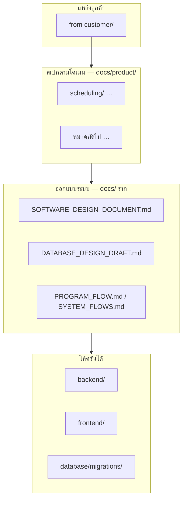

# โครงสร้าง Application (มุมมองบูรณาการ)

เอกสารนี้อธิบาย **ชั้นของความรู้และโค้ด** ใน repo ให้ทีมและข้อ requirement ถัดไปวางต่อได้สม่ำเสมอ — อ่านคู่ [`PROJECT_STRUCTURE.md`](PROJECT_STRUCTURE.md) (tree โฟลเดอร์ + DB)

| อัปเดต | 2026-05-07 |
|--------|------------|

---

## 1. ชั้นข้อมูลและเอกสาร (จากสเปก → โค้ด)

| ชั้น | ที่เก็บ | หน้าที่ |
|-----|---------|---------|
| **A — แหล่งดิบลูกค้า** | `from customer/` | Word/Excel/PPT ต้นฉบับ — **ไม่แก้เป็นหลักใน repo** ยกเว้นทีมตกลง |
| **B — สเปกผลิตภัณฑ์ตามโดเมน** | [`docs/product/`](product/README.md) | คำจำกัดความคอลัมน์, วัตถุประสงค์ module, ข้อถัดไปเพิ่มเป็นโฟลเดอร์ย่อย |
| **C — วิศวกรรมรวม** | `docs/*.md` (SDD, DB draft, flows, SAP columns) | เชื่อมหลายโดเมน, ER, API, โฟลว์เทคนิค |
| **D — โค้ด** | `backend/`, `frontend/`, `database/` | implementation |

---

## 2. Feature map (โครงการ) ↔ ที่อยู่ใน repo

| Epic / พื้นที่ | โค้ดหลัก | เอกสารสนับสนุน |
|-----------------|----------|-----------------|
| นำเข้า SAP / IW37N (F01) | `backend` import routes, `data-import` FE | [`SAP_DATA_IMPORT_EXPORT_COLUMNS.md`](SAP_DATA_IMPORT_EXPORT_COLUMNS.md), [`SYSTEM_FLOWS.md`](SYSTEM_FLOWS.md) §C–D |
| ปฏิทิน / Planning / Close WO (F02) | `frontend/src/features/scheduling/pages/` (`WorkCalendarPage`, `DailyAssignmentReportPage`), routes ภายใต้ `workOrders` | [`product/scheduling/`](product/scheduling/README.md), [`UI_LEGACY_MODERN_GUIDELINE.md`](UI_LEGACY_MODERN_GUIDELINE.md) |
| แดชบอร์ด / KPI | `dashboard` FE/BE | [`PROGRAM_FLOW.md`](PROGRAM_FLOW.md), SDD |
| RBAC / Admin | `admin`, `permissions` | SDD ภาคผนวกสิทธิ์ |

*(ปรับแถวเมื่อเพิ่ม Epic)*

---

## 3. กติกาเมื่อมี “ข้อถัดไป” จากลูกค้า

1. **จับหมวด** — PM scheduling → `docs/product/scheduling/`; ถ้าเป็นหมวดใหม่ → สร้าง `docs/product/<ชื่อหมวด>/` + README สั้น  
2. **เขียน spec** — ใช้ [`product/_SPEC_TEMPLATE.md`](product/_SPEC_TEMPLATE.md)  
3. **ลงทะเบียน** — เพิ่มบรรทัดใน [`docs/README.md`](README.md)  
4. **ถ้ามีผลต่อ DB/API** — อัปเดต `DATABASE_DESIGN_DRAFT.md` / migration / `openapi.yaml` ตามขั้นตอนทีม

---

## 4. ลิงก์ด่วน

| ต้องการ | ไปที่ |
|---------|--------|
| ดัชนีเอกสารทั้งหมด | [`README.md`](README.md) |
| Flow ตามบทบาทผู้ใช้ | [`SYSTEM_FLOWS_SIMPLE.md`](SYSTEM_FLOWS_SIMPLE.md) |
| Tree โฟลเดอร์ repo | [`PROJECT_STRUCTURE.md`](PROJECT_STRUCTURE.md) |
