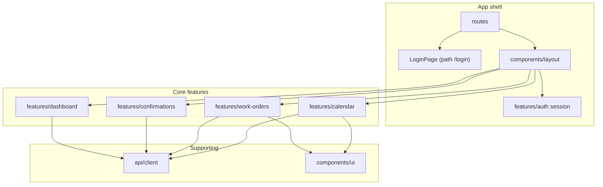

# Frontend structure (แนวทาง + tree view)

สถานะ repo: มี **`frontend/`** แบบ **Vite + React + TypeScript + Ant Design** (พอร์ต **3000**) — เชื่อม **`VITE_API_BASE_URL`** กับ backend (`/api/v1/auth/me`, `/work-orders`, …) · ยังไม่ติดตั้ง chart/anime ในแอปจริง (ดู checklist §8) — สอด [`PROJECT_PLAN.md`](PROJECT_PLAN.md) P2-3 / M2 vertical slice

**รัน dev:** `cd frontend && cp .env.example .env` (ปรับ URL ถ้าจำเป็น) แล้ว `npm install` · `npm run dev` — เปิด `http://127.0.0.1:3000` คู่กับ backend `npm run dev` ที่พอร์ต **5000**

**สแต็กที่ล็อก (โครงการ PM):** **React + Vite + TypeScript** · **Responsive design** · **Ant Design** · **anime.js** · **Chart.js** และ **Highcharts** (กราฟ)

---

## 1. เทคโนโลยีที่ล็อกแนะนำ

| ชั้น | แนะนำ | หมายเหตุ |
|------|--------|-----------|
| UI | **React 18+** | URS/SRS อ้าง React.js (ปฏิทิน interactive, real-time) |
| ภาษา | **TypeScript** | ลดข้อผิดพลาดกับโมเดลข้อมูล WO / assignment |
| Build / dev server | **Vite** | เร็ว, คอนฟิกง่าย, ผูกพอร์ต 3000 ได้ตรง SRS |
| Routing | **React Router v6** | แยก route ตามบทบาท / ฟีเจอร์ |
| Data fetching | **TanStack Query** + `fetch` / axios | cache, retry, สถานะโหลด |
| **Component library** | **Ant Design (antd)** | ฟอร์ม, ตาราง, Modal, Layout, DatePicker — ลดงาน UI พื้นฐาน; ใช้ `@ant-design/icons` |
| **Responsive** | **Ant Design Grid** (`Row`/`Col`) + `Grid.useBreakpoint` | จัด layout มือถือ / แท็บเล็ต / เดสก์ท็อป; ทดสอบ breakpoint ตาม requirement หน้างาน |
| **Animation** | **anime.js** | micro-interaction, transition เล็ก ๆ (ไม่แทนที่ logic ธุรกิจ) |
| **Charts** | **Chart.js** + `react-chartjs-2` และ **Highcharts** + `highcharts-react-official` | ใช้คู่กันได้ตามจอ — แนะนำแยกหน้าที่: เช่น KPI/dashboard หนึ่งชุด, รายงานละเอียดอีกชุด; หลีกเลี่ยงโหลดสองไลบรารีในหน้าเดียวถ้าไม่จำเป็น (ขนาด bundle) |
| Styling เสริม | **Token โครงการ** ใน `styles/tokens.css` + **ConfigProvider** ของ antd | สีสถานะงานตาม Rev.1 — override theme antd ให้สอด brand / สถานะ WO |

ถ้าทีมเลือก **Next.js** แทน Vite ให้ย้าย `src/pages` หรือ `app/` ตามแบบ App Router — โครง `features/` ด้านล่างยังใช้ได้เหมือนเดิม (แต่ **แผนปัจจุบันล็อก Vite**)

### 1.1 แพ็กเกจ npm หลัก (อ้างอิงตอนติดตั้ง)

```text
react react-dom
typescript vite @vitejs/plugin-react
react-router-dom
@tanstack/react-query
antd @ant-design/icons
animejs
chart.js react-chartjs-2
highcharts highcharts-react-official
```

(เวอร์ชันคงที่ใน `package.json` ตามนโยบายทีม — ใช้ `npm install` ครั้งแรกแล้ว commit lockfile)

---

## 2. ตำแหน่งใน monorepo

แนะนำโฟลเดอร์ราก **`frontend/`** ขนานกับ `database/`, `docs/`, `scripts/` (ไม่ซ้อนใน `docs/`)

---

## 3. Tree view — โครงสร้างโฟลเดอร์แนะนำ

```
frontend/
├── package.json
├── tsconfig.json
├── tsconfig.node.json
├── vite.config.ts                 # server.port = 3000 (สอด F12 / ภาคผนวก ค)
├── index.html
├── .env.example                     # VITE_API_BASE_URL, …
├── public/
│   └── favicon.ico
├── src/
│   ├── main.tsx                     # hydrate root
│   ├── App.tsx                      # layout shell, ConfigProvider (antd), QueryClientProvider
│   ├── vite-env.d.ts
│   │
│   ├── routes/                      # หรือ pages/ ถ้าใช้ file-based router
│   │   ├── index.tsx                # route table / lazy imports
│   │   ├── ProtectedLayout.tsx      # auth + RBAC shell
│   │   └── …
│   │
│   ├── features/                    # จัดตาม domain / Fxx (ดู §4)
│   │   ├── auth/
│   │   │   ├── pages/
│   │   │   │   └── LoginPage.tsx    # route: /login — ฟอร์ม GPID/รหัสผ่านหรือ SSO ตามดีไซน์ทีม
│   │   │   ├── components/
│   │   │   │   └── LoginForm.tsx    # optional — แยกจาก page ถ้าฟอร์มยาวหรือ reuse
│   │   │   ├── hooks/
│   │   │   │   └── useAuthSession.ts # JWT ใน memory + refresh / logout
│   │   │   ├── api.ts               # POST login / refresh (อ้าง OpenAPI `/auth/*`)
│   │   │   └── index.ts             # public API ของ feature
│   │   │
│   │   ├── data-import/             # F01 / F03 / F04 — นำเข้าไฟล์ export จาก SAP (ดู §3.1)
│   │   │   ├── pages/
│   │   │   │   ├── DataImportPage.tsx       # route: /data/import — layout + tabs
│   │   │   │   ├── Iw37nImportTab.tsx       # อัปโหลด IW37N*.xls → API kind=iw37n
│   │   │   │   ├── ConfirmWoImportTab.tsx   # Confirm WO*.xls(x) → kind=confirm_wo
│   │   │   │   └── GiGrImportTab.tsx        # GI*.xls / GR*.xls → kind=gi | gr
│   │   │   ├── components/
│   │   │   │   ├── SapFileDropzone.tsx      # รับ .xls / .xlsx, drag-drop, จำกัดขนาด
│   │   │   │   ├── ImportKindTabs.tsx       # IW37N | Confirm WO | GI | GR
│   │   │   │   ├── ImportSubmitForm.tsx     # เลือกไฟล์ + plant (ถ้ามี) + ปุ่มส่ง
│   │   │   │   ├── ImportBatchTable.tsx    # ตาราง import_batches (สถานะ, แถวสำเร็จ/ผิด)
│   │   │   │   ├── ImportErrorsPanel.tsx   # รายการ import_errors ต่อ batch
│   │   │   │   └── ImportProgressModal.tsx # optional — progress ระหว่างอัปโหลด
│   │   │   ├── hooks/
│   │   │   │   ├── useSapFileImport.ts      # TanStack Query mutation ต่อ kind
│   │   │   │   ├── useImportBatches.ts      # list batches + poll status
│   │   │   │   └── useImportErrors.ts
│   │   │   ├── types.ts                     # ImportKind, ImportBatchDTO, …
│   │   │   ├── api.ts                       # wrap endpoints/import.ts
│   │   │   └── index.ts
│   │   │
│   │   ├── work-orders/             # F02 list + รายละเอียด (เชื่อม `GET /api/v1/work-orders`, `GET …/:id`)
│   │   │   ├── pages/
│   │   │   │   ├── WorkOrdersPage.tsx        # /work-orders — ตาราง + ลิงก์ Order # → detail
│   │   │   │   └── WorkOrderDetailPage.tsx   # /work-orders/:workOrderId — Descriptions + ลิงก์หลักฐาน
│   │   │   └── api.ts                        # fetchWorkOrders, fetchWorkOrder, createTaskLog
│   │   ├── calendar/                # F02 Month/Week/Day, DnD, สี, Reason
│   │   ├── assignments/             # มอบหมายช่าง, available hour (URS)
│   │   ├── confirmations/           # F05 confirm WO, reason, sync status
│   │   ├── materials-handheld/     # QR, TECO, GI context (F03/F04 UI slice)
│   │   ├── movements/               # มุมมอง GI/GR หลัง normalize (อ่านจาก API)
│   │   ├── work-centers/            # F07 (+ import WC ถ้าเปิด scope ภายหลัง)
│   │   │
│   │   ├── sap/                     # F08 — ใน repo ใช้โฟลเดอร์ `sap/` (ไม่ใช่ `sap-reports/`) · route `/sap-reports`
│   │   │   └── pages/
│   │   │       └── SapReportsPage.tsx       # placeholder — ยังไม่เชื่อม export API
│   │   │
│   │   ├── dashboard/               # F09 KPI, backlog — กราฟ Chart.js / Highcharts แยกโฟลเดอร์ย่อยได้ เช่น components/charts/
│   │   └── admin/                   # F10 users/roles UI
│   │
│   ├── components/                  # ใช้ร่วมข้าม feature
│   │   ├── layout/
│   │   │   ├── AppHeader.tsx        # เมนู: แนะนำลิงก์ “นำเข้าข้อมูล SAP” → /data/import
│   │   │   ├── AppSidebar.tsx
│   │   │   └── PageContainer.tsx
│   │   └── ui/                      # wrapper รอบ antd หรือ composite เล็ก ๆ (ถ้าไม่ใช้ antd ตรง ๆ ในทุกที่)
│   │       └── …
│   │
│   ├── api/                         # HTTP client, interceptors, types จาก OpenAPI (ถ้ามี)
│   │   ├── client.ts
│   │   └── endpoints/
│   │       ├── import.ts            # POST multipart /imports; GET /imports/batches
│   │       └── sapExport.ts         # GET/POST export ตาม F08
│   │
│   ├── hooks/                       # ข้าม feature (useMediaQuery, useDebounce, …)
│   ├── lib/                         # formatDate, cn(), error mapping, ตัวช่วย anime.js (optional)
│   │   └── images/
│   │       └── convertToWebp.ts     # แปลง JPEG/PNG → WebP ก่อนอัปโหลดหลักฐาน (สอดคล้อง MEDIA_WEBP_POLICY)
│   ├── types/                       # shared TS types (WorkOrder, User, …)
│   ├── styles/
│   │   ├── global.css
│   │   └── tokens.css               # สีสถานะงาน / brand ตาม Rev.1
│   └── config/
│       └── env.ts                   # import.meta.env.VITE_* แบบ type-safe
│
└── tests/                           # หรือ colocate *.test.tsx ใต้ features/
    ├── setup.ts
    └── …
```

หลักการ: **`features/*` เป็นเจ้าของหน้าจอ+hook+api เฉพาะโดเมน** — `components/ui` ไม่ผูกธุรกิจ; หลีกเลี่ยงไฟล์ยักษ์ใน `src/` ราก

### 3.1 `data-import/` ↔ ชั้นฐานข้อมูล (อ้างอิง)

| แท็บ / `source_kind` (แนะนำ) | ไฟล์ตัวอย่างจากลูกค้า | ตาราง staging (MariaDB) |
|------------------------------|----------------------|---------------------------|
| IW37N | `from customer/SAP data/Data/IW37N*.xls` | `stg_iw37n_row` |
| Confirm WO | `Confirm WO.xls`, `PC50 Y2018 Confirm.*` | `stg_confirm_wo_row` |
| GI | `GI*.xls` | `stg_mb51_row` (+ `movement_kind` ที่ BE) |
| GR | `GR*.xls` | `stg_mb51_row` |

ทุกครั้งที่อัปโหลดสำเร็จควรมีแถวใน `import_batches` + อาจมี `import_errors` — UI ใน `ImportBatchTable` / `ImportErrorsPanel`

### 3.2 `sap/` + route `/sap-reports` (export F08)

โฟลเดอร์ **`features/sap/`** ใน repo (หน้า placeholder) — แผนขยายเป็น **ดาวน์โหลด / สร้างไฟล์** ให้สอด template (IW37N, MB51, IP19 ตาม scope) ไม่ใช่แท็บใน `data-import`

### 3.3 รูปภาพหลักฐาน (before / after และแนบใบงาน)

- **ก่อนส่ง API / ก่อนบันทึก metadata ลง DB:** แปลงเป็น **WebP** ใน `lib/images/convertToWebp.ts` (หรือทางเลือกเทียบเท่า) — ลดการโตของ storage บน Drive D  
- รายละเอียดกฎ คุณภาพ ขนาด และทางเลือก backend: [`MEDIA_WEBP_POLICY.md`](MEDIA_WEBP_POLICY.md)  
- ไม่ใช้กับไฟล์นำเข้า SAP (spreadsheet)

---

## 4. แมปฟีเจอร์ (PROJECT_PLAN Fxx) → โฟลเดอร์ `features/`

| ID | Feature | โฟลเดอร์หลักใน `features/` | หมายเหตุสั้น |
|----|---------|---------------------------|----------------|
| F02 | ปฏิทิน / search / filter | `calendar/`, `work-orders/` | Drag&Drop, สี, Reason — แยก component ย่อยภายใน `calendar/` |
| F09 | Dashboard KPI | `dashboard/` | กราฟ/ตาราง backlog — ดึง API aggregate |
| F10 | RBAC | `auth/`, `admin/` | route guard + permission hook |
| F07 | Work center list | `work-centers/` | ตาราง read-only หรือ CRUD ตาม scope |
| F08 | SAP reports | `sap/` (`SapReportsPage` ที่ path `/sap-reports`) | Export / ดาวน์โหลด template — ดู tree §3 · โฟลเดอร์จริงชื่อ `sap/` |
| **F01** | IW37N import | **`data-import/`** (`Iw37nImportTab`) | อัปโหลดไฟล์ → staging + normalize ฝั่ง BE |
| **F03** / **F04** | GI / GR import | **`data-import/`** (`GiGrImportTab`) | แยกแท็บหรือ selector `gi` / `gr` |
| **F05** | Confirm WO | **`confirmations/`** (กดยืนยันในแอป) + **`data-import/`** (`ConfirmWoImportTab`) สำหรับ **นำเข้าไฟล์** Confirm จาก SAP | อย่าสับสนระหว่าง “อัปโหลดไฟล์” กับ “ฟอร์มยืนยันงาน” |
| F06 / F07 | FL / Work center | `work-centers/` (+ import แยกภายหลังถ้ามี) | ไฟล์ FL อาจไม่แบน — ล็อกกับทีม SAP ก่อนมี UI |
| F12 | Deploy พอร์ต 3000 | `vite.config.ts`, `Dockerfile` (เมื่อเพิ่ม) | ไม่ใช่โฟลเดอร์ UI |

หลัง import แล้ว มุมมองข้อมูล: **`work-orders/`**, **`movements/`**, **`calendar/`** — อ่านจาก API ไม่ใช่โฟลเดอร์อัปโหลดไฟล์

---

## 4.0 Auth / หน้า login

| หน้า | Route | โฟลเดอร์แนะนำ | หมายเหตุ |
|------|-------|----------------|----------|
| **เข้าสู่ระบบ** | `/login` | `features/auth/pages/LoginPage.tsx` | เรียก API login ตาม [`BACKEND_STRUCTURE.md`](BACKEND_STRUCTURE.md) / `openapi.yaml`; `ProtectedLayout` redirect มาที่นี่ถ้าไม่มี session |

ส่วน **F10 RBAC** (จัดผู้ใช้/บทบาทหลัง login) อยู่ที่ `/admin/users` — แยกจากหน้า login

---

## 4.1 หน้าไหน — import / export ไฟล์ SAP

แผน UI สอด [`PROJECT_PLAN.md`](PROJECT_PLAN.md) และข้อมูลตัวอย่างใน `from customer/SAP data/` — **ยังไม่ implement ใน repo**

### Import (อัปโหลดไฟล์จาก SAP export → แอป / staging)

| หน้า (แนะนำ) | Route ตัวอย่าง | Fxx | ชนิดไฟล์ / รายงาน SAP (ตัวอย่างใน repo) |
|--------------|----------------|-----|----------------------------------------|
| **นำเข้า IW37N / ใบงาน** | `/data/import` (แท็บ IW37N) หรือ `/work-orders/import` | **F01** | `IW37N*.xls` → `stg_iw37n_row` |
| **นำเข้า Confirm WO** | `/data/import` (แท็บ Confirm) | **F01** (กระบวนการ), **F05** (ใช้ผลใน UI confirm) | `Confirm WO.xls`, `PC50 Y2018 Confirm.*` → `stg_confirm_wo_row` |
| **นำเข้า GI / GR (movement)** | `/data/import` (แท็บ GI/GR) หรือ `/movements/import` | **F03**, **F04** | `GI*.xls`, `GR*.xls` → `stg_mb51_row` |
| **นำเข้า Work center / FL** (ถ้าเปิด scope) | `/work-centers/import` หรือแท็บใน `/data/import` | **F06**, **F07** | `Work Center list.xls`, FL/Equipment (รูปแบบไฟล์ต้องล็อกกับทีม SAP) |

หน้า import ควรมี: เลือกไฟล์ → อัปโหลด → แสดง **batch id / จำนวนแถวสำเร็จ–ผิด** → ลิงก์ไป `import_errors` / log

### Export (จากแอป → ไฟล์หรือระบบ SAP)

| หน้า (แนะนำ) | Route ตัวอย่าง | Fxx | หมายเหตุ |
|--------------|----------------|-----|----------|
| **รายงาน / template SAP** | `/sap-reports` | **F08** | ดาวน์โหลดหรือสร้างไฟล์ให้ตรงคอลัมน์ template (IP19, IW37N, MB51 ตาม scope Feature 11) — อ้าง `IW37N & MB51 template.xlsx` ใน `from customer/` |
| **ส่งข้อมูลกลับ SAP** | มัก **ไม่ใช่แค่ “ดาวน์โหลดไฟล์”** แต่เป็น BAPI/LSMW/MII ที่ฝั่ง MM/PM | F05 / F03 / F04 ตามดีไซน์ | UI อาจเป็น “ส่ง confirm / movement” + สถานะ `sync_to_sap_status` — ล็อกกับทีม SAP |

สรุป: **import โฟกัสที่หน้า `/data/import` (หรือแยก route ตามแท็บ)** + **export/รายงานที่ `/sap-reports`**; รายละเอียดคอลัมน์อ้าง [`SAP_DATA_IMPORT_EXPORT_COLUMNS.md`](SAP_DATA_IMPORT_EXPORT_COLUMNS.md)

---

## 5. Routing แนะนำ (ตัวอย่าง path)

| Path | บทบาท |
|------|--------|
| `/login` | **หน้าเข้าสู่ระบบ** — `features/auth/pages/LoginPage.tsx`; หลังสำเร็จ redirect ตาม role (ไม่ผ่าน `ProtectedLayout` จนกว่าจะมี token) |
| `/` | ใน repo ปัจจุบัน: `HomePage` — แผนอนาคตอาจ redirect → `/calendar` หรือ `/work-orders` ตาม role |
| `/calendar` | F02 — **ใน repo:** ใช้ **`/work-orders/calendar`** เป็น IA placeholder (`WorkCalendarPlaceholderPage`) |
| `/work-orders` | list — `WorkOrdersPage` · `GET /api/v1/work-orders` |
| `/work-orders/calendar` | F02 — ต้นแบบ IA (ปฏิทินละเอียดแผนใน Rev.1) |
| `/work-orders/:workOrderId` | รายละเอียด — `WorkOrderDetailPage` · `GET /api/v1/work-orders/:workOrderId` · ลิงก์ไป `/evidence?workOrderId=…` |
| `/data/import` | **Import ไฟล์ SAP** (IW37N / Confirm / GI·GR แท็บหรือ wizard) |
| `/sap-reports` | **Export / รายงาน** F08 — `features/sap/pages/SapReportsPage.tsx` (placeholder) |
| `/dashboard` | F09 — รวมการ์ดสั่ง **`POST /api/v1/jobs/kpi-snapshot`** + ลิงก์ไป `/jobs/:jobId` |
| `/reports/kpi` | รายงาน KPI (Highcharts) · `GET /api/v1/dashboard/kpi-snapshots` |
| `/evidence` | หลักฐานรูป — รองรับ query **`?workOrderId=`** เติมฟอร์มอัตโนมัติ |
| `/jobs` | ศูนย์กลางติดตามคิว — placeholder + ไป `/jobs/:jobId` |
| `/jobs/:jobId` | สถานะคิวงาน (`import_jobs`) |
| `/admin/users` | F10 — `AdminUsersPage` · `GET/PATCH /api/v1/admin/users` + `GET /api/v1/admin/roles` (`admin.users`) |

เก็บ **route constants** ใน [`src/config/routes.ts`](../frontend/src/config/routes.ts) (`ROUTES`, `ROUTE_SEGMENTS`, `evidenceWithWorkOrder`) — สิทธิ์หน้าแอดมิน: [`PermissionGate`](../frontend/src/routes/PermissionGate.tsx) + [`permissions.ts`](../frontend/src/config/permissions.ts)

### 5.1 Dashboard (F09) — มุมมองรวม vs รายบุคคล

- **มุมมองรวม (โรงงาน / ทีม):** เหมาะกับ planner / หัวหน้า — KPI, backlog, downtime รวม — API aggregate + สิทธิ์ `report.dashboard` แบบอ่านข้อมูลทั้งหมดที่ policy อนุญาต  
- **มุมมองรายบุคคล (ช่าง):** ใบงานที่ได้รับมอบหมาย (`work_order_assignments`), confirm/ชั่วโมงของตน — กรองด้วย `user_id` จาก session/JWT  
- **แนวทาง UX:** ใช้โมดูลเดียว (`features/dashboard/`) แล้วแยกแท็บหรือ route เช่น `/dashboard` (รวม) กับ `/dashboard/me` (ส่วนตัว) และเลือก default ตาม role — ไม่จำเป็นต้องมี “แอปคนละชุด” ถ้าชุดการ์ด/กราฟ reuse ได้และแค่ชุดข้อมูลจาก API ต่างกัน

---

## 6. ตัวแแปรสภาพแวดล้อม (ตัวอย่าง `.env.example`)

```env
VITE_API_BASE_URL=http://127.0.0.1:5000/api
VITE_APP_TITLE=Pepsi PM
```

Backend พอร์ต **5000** และ DB **3307** อ้างภาคผนวกค / [`INSTALL_SOP_TAILSCALE_DOCKER.md`](INSTALL_SOP_TAILSCALE_DOCKER.md) — ปรับ URL ตาม compose จริง

---

## 7. แผนภาพความสัมพันธ์ชั้น UI (mermaid)



---

## 8. งาน scaffold ถัดไป (checklist)

- [x] `vite.config.ts` พอร์ต **3000**  
- [x] **antd** + **@ant-design/icons** + `ConfigProvider` (locale `th_TH`)  
- [x] **chart.js** + **react-chartjs-2** — กราฟแดชบอร์ด (`/dashboard`) + `GET /api/v1/dashboard/stats`  
- [x] **highcharts** + **highcharts-react-official** — หน้า **`/reports/kpi`** (รายงาน snapshot ละเอียด; โหลด lazy)  
- [ ] **anime.js** — micro-interaction  
- [x] **`features/auth`** (Login dev-token + `AuthContext`) · **`features/home`** · **`features/work-orders`** (list + **`WorkOrderDetailPage`**) · **`api/client.ts`**  
- [x] TanStack Query + React Router + layout shell  
- [ ] ทดสอบ **responsive** อย่างน้อย 3 breakpoint บนหน้าหลักและปฏิทิน (เมื่อมีปฏิทิน)  
- [x] `VITE_API_BASE_URL` → backend (`GET /api/v1/health`, `/auth/me`, `/work-orders`, **`GET /work-orders/:id`**)  
- [x] `features/data-import` — หน้า `/data/import` (อัปโหลด + รายการ batch + normalize sync/async + ดู errors) — F01/F03/F04 ฝั่ง UI  
- [ ] รูปหลักฐาน (before/after): ผูก UI อัปโหลดกับ `convertToWebp` + `POST …/task-logs/…/attachments` — [`MEDIA_WEBP_POLICY.md`](MEDIA_WEBP_POLICY.md)

---

## 9. ลิงก์ที่เกี่ยวข้อง

| เอกสาร | เนื้อหา |
|---------|---------|
| [`PROJECT_PLAN.md`](PROJECT_PLAN.md) | M2/M3, F02–F12, P2-3 / P2-4 |
| [`PROJECT_STRUCTURE.md`](PROJECT_STRUCTURE.md) | tree repo + ฐานข้อมูล |
| [`INSTALL_SOP_TAILSCALE_DOCKER.md`](INSTALL_SOP_TAILSCALE_DOCKER.md) | พอร์ต 3000 / 5000 / 3307 |
| [`BACKEND_STRUCTURE.md`](BACKEND_STRUCTURE.md) | API ฝั่ง Node (พอร์ต **5000**) + middleware |
| [`PROGRAM_FLOW.md`](PROGRAM_FLOW.md) | ลำดับ import → normalize → worker |
| [`ER_DIAGRAM.md`](ER_DIAGRAM.md) | ER ตาราง `pepsi_pm` (Mermaid) |
| [`api/openapi.yaml`](api/openapi.yaml) | สัญญา REST ให้ `src/api/endpoints/*` อ้างอิง |
| [`../backend/README.md`](../backend/README.md) | รัน backend dev |
| [`MEDIA_WEBP_POLICY.md`](MEDIA_WEBP_POLICY.md) | รูป before/after → WebP ก่อนบันทึก |

---

| เวอร์ชัน | หมายเหตุ |
|----------|----------|
| 1.0 | 2026-05-04 — โครงแนะนำครั้งแรก (repo ยังไม่มี frontend code) |
| 1.1 | 2026-05-04 — §4.1 หน้า import/export SAP + route `/data/import`, `/sap-reports` |
| 1.2 | 2026-05-04 — ขยาย tree §3: `data-import/` + `sap-reports/` ละเอียด, `api/endpoints/import.ts`, §3.1–3.2, แก้ตาราง §4 |
| 1.3 | 2026-05-04 — ลิงก์ backend + [`api/openapi.yaml`](api/openapi.yaml) |
| 1.4 | 2026-05-04 — §5.1 Dashboard รวม vs รายบุคคล (F09) |
| 1.5 | 2026-05-04 — ลิงก์ [`PROGRAM_FLOW.md`](PROGRAM_FLOW.md), [`ER_DIAGRAM.md`](ER_DIAGRAM.md) |
| 1.6 | 2026-05-04 — เติมหน้า login ใน tree §3 (`LoginPage`, `LoginForm`, `useAuthSession`), §4.0, §5 คำอธิบาย `/login`, mermaid §7, checklist §8 |
| 1.7 | 2026-05-04 — ล็อกสแต็ก: Ant Design, responsive, anime.js, Chart.js, Highcharts; §1.1 แพ็กเกจ npm; อัปเดต tree §3, checklist §8 |
| 1.8 | 2026-05-04 — §3.3 + `lib/images/convertToWebp.ts`, checklist WebP; ลิงก์ [`MEDIA_WEBP_POLICY.md`](MEDIA_WEBP_POLICY.md) |
| 1.9 | 2026-05-05 — แอป Vite+React+antd ครบ: auth/me, work-orders, Login dev-token; อัปเดต checklist §8 |
| 1.10 | 2026-05-05 — `/data/import` นำเข้า SAP + normalize + errors modal |
| 1.11 | 2026-05-05 — `/evidence` (WebP + แนบรูป), `/jobs/:id` poll, `/dashboard` ย่อ, POST WO→task_logs |
| 1.12 | 2026-05-05 — กราฟ Chart.js บน `/dashboard` (doughnut / bar / line) + API `dashboard/stats` |
| 1.13 | 2026-05-05 — KPI จาก `kpi_daily_snapshots` (Chart.js trend) + `/reports/kpi` (Highcharts) + `GET …/kpi-snapshots` |
| 1.14 | 2026-05-05 — `/work-orders/:workOrderId` + `/sap-reports` (`features/sap/`) + แดชบอร์ดสั่ง KPI snapshot + `?workOrderId=` บน `/evidence`; sync [`BACKEND_STRUCTURE.md`](BACKEND_STRUCTURE.md) / OpenAPI |
