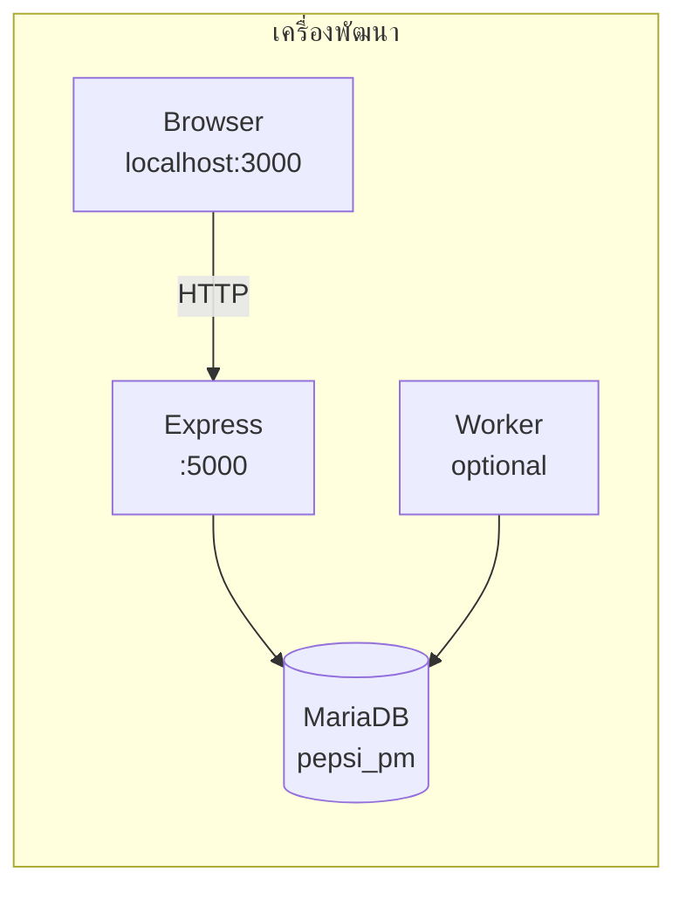
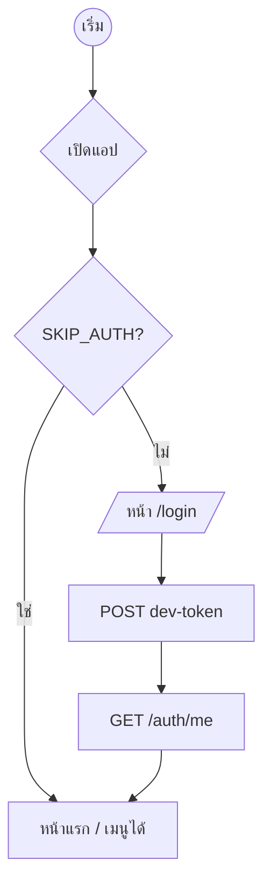
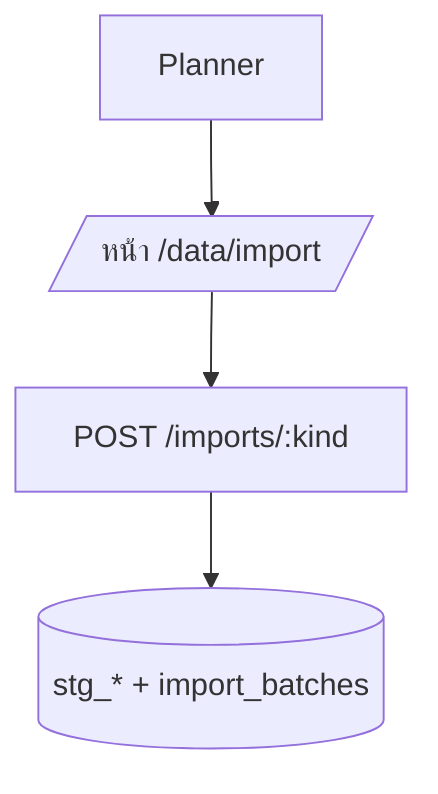
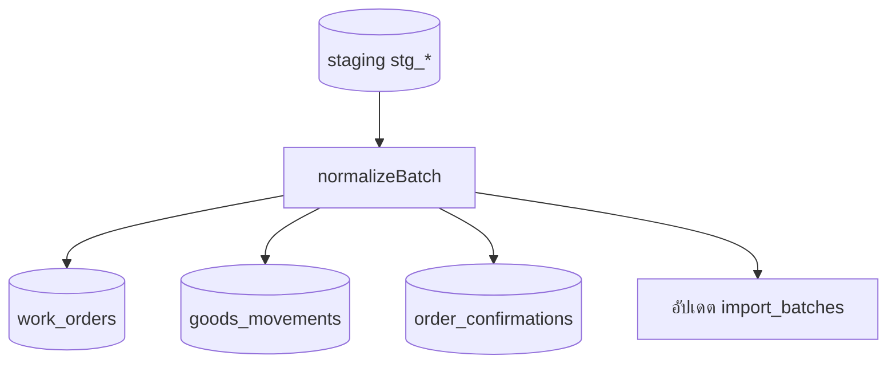
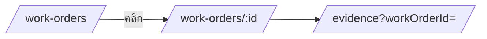
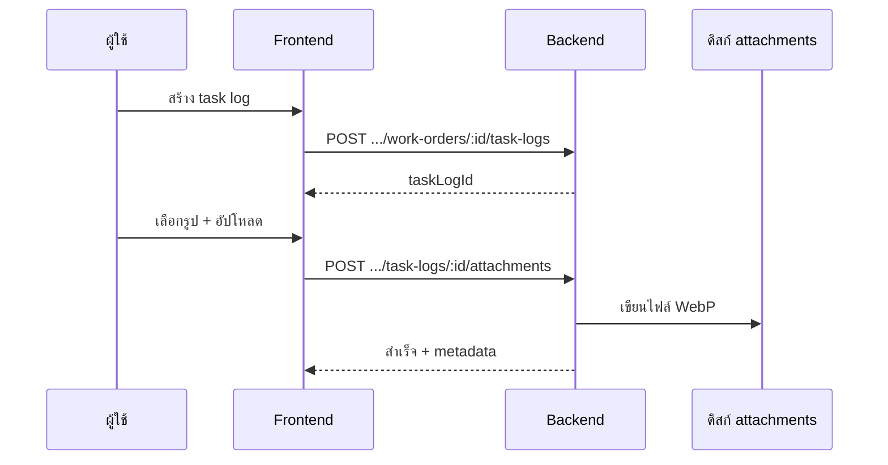
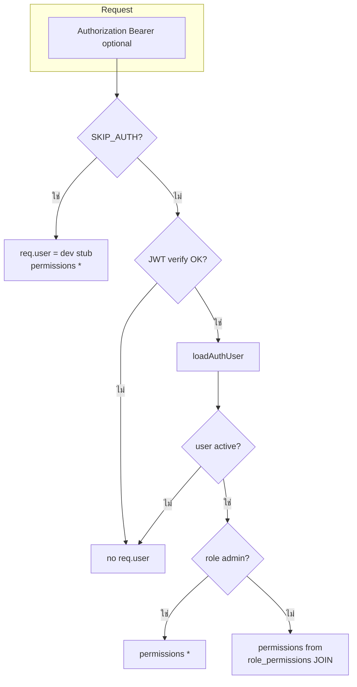
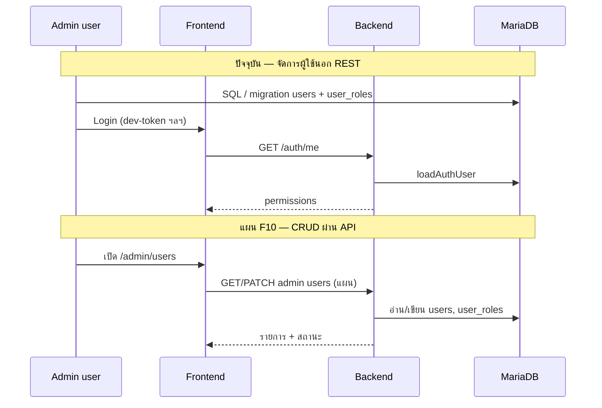

# Flow ระบบ Pepsi PM — ลำดับการทำงานแบบละเอียด

> **สำหรับลูกค้า / ฝ่ายธุรกิจ — อ่านแบบสั้น ใช้ลูกศร `>` ต่อขั้น:** ดู [`SYSTEM_FLOWS_SIMPLE.md`](SYSTEM_FLOWS_SIMPLE.md)

เอกสารนี้อธิบาย **flow การใช้งานและ flow ทางเทคนิค** ของระบบใน repo ปัจจุบัน (Frontend + Backend + Worker + MariaDB) เป็นขั้นตอนที่อ่านตามลำดับได้ — **ไม่ใช่ SRS ลูกค้า** แต่ใช้สอดกับ [`PROJECT_PLAN.md`](PROJECT_PLAN.md) และ [`PROGRAM_FLOW.md`](PROGRAM_FLOW.md)

| รายการ | ค่า |
|--------|-----|
| อัปเดตล่าสุด | 2026-05-06 |
| สถานะ | สอดโค้ดใน repo — ส่วน “แผนอนาคต” แยกเป็นหัวข้อท้ายเอกสาร |

---

## สารบัญ flow หลัก

| # | ชื่อ flow | ใครเป็นหลัก | หมายเหตุสั้น |
|---|------------|-------------|----------------|
| A | [เปิดระบบ (dev)](#a-flow-เปิดระบบสำหรับพัฒนา--ทดสอบ) | IT / Dev | FE :3000, BE :5000, DB, (optional) worker |
| B | [เข้าสู่ระบบ](#b-flow-เข้าสู่ระบบ-auth) | ทุกบทบาท | JWT dev-token หรือ `SKIP_AUTH` |
| C | [นำเข้าเอกสารจาก SAP](#c-flow-นำเข้าเอกสารจาก-sap--import) | Planner / ผู้ดูแลข้อมูล | อัปโหลดไฟล์ → staging |
| D | [Normalize](#d-flow-normalize-เข้าตารางปฏิบัติการ) | เดียวกับ C หรือระบบ | sync ใน HTTP หรือ async + worker |
| E | [ดูใบงาน](#e-flow-ดูใบงาน-work-orders) | Planner / ช่าง / หัวหน้า | list → รายละเอียด |
| F | [หลักฐานรูป](#f-flow-หลักฐานรูป-before--after) | ช่าง / ผู้ปฏิบัติ | task log → อัปโหลดรูป |
| G | [แดชบอร์ด + KPI snapshot](#g-flow-แดชบอร์ดและ-kpi-snapshot) | หัวหน้า / Planner | กราฟ + สั่งคิว materialize snapshot |
| H | [รายงาน KPI](#h-flow-รายงาน-kpi-ละเอียด) | หัวหน้า | อ่าน snapshot จาก DB + กราฟ Highcharts |
| I | [ติดตามคิวงาน](#i-flow-ติดตามคิวงาน-jobs) | ผู้กด normalize async / KPI | `/jobs/:id` |
| J | [รายงาน SAP (placeholder)](#j-flow-รายงาน-sap-placeholder) | ตามแผน F08 | ยังไม่เชื่อม export API |
| K | [ความผิดพลาดการนำเข้า](#k-flow-ดูความผิดพลาดการนำเข้า-import-errors) | Planner / ผู้ดูแลข้อมูล | `GET …/import-batches/:id/errors` |
| L | [Admin / RBAC (F10)](#l-flow-admin--rbac-f10) | ผู้ดูแลระบบแอป / Dev | โหลดสิทธิ์จาก DB + `requirePermission`; UI จัดการผู้ใช้แผน |

ด้านล่างมี **flow แบบเล่าเป็นข้อ** + **แผนภาพ Mermaid** สำหรับเส้นทางสำคัญ

---

## บทบาท (ย่อ — อ้างอิงภาพรวมโครงการ)

- **Planner / ผู้วางแผนซ่อม:** ดูภาพรวมงาน, นำเข้าข้อมูล SAP, ดูแดชบอร์ด, เปิดรายละเอียดใบงาน  
- **ช่าง / ผู้ปฏิบัติ:** (ใน repo ปัจจุบัน) เน้น **หลักฐานรูป** ผูกกับใบงาน — ปฏิทิน / มอบหมายงานยังเป็นแผน SRS  
- **ผู้ดูแลระบบแอป (RBAC / F10):** กำหนดว่าใครมี role อะไรใน `users` / `user_roles` — ปัจจุบันมักจัดการผ่าน migration/SQL; หน้า **`/admin/users`** เป็นแผน UI (ดู [§L](#l-flow-admin--rbac-f10))  
- **ผู้ดูแลโครงสร้าง / Dev (IT):** ตั้งค่า env, DB, worker, CORS, JWT — flow เปิดสแต็กดู [§A](#a-flow-เปิดระบบสำหรับพัฒนา--ทดสอบ)  

---

## A. Flow เปิดระบบ (สำหรับพัฒนา / ทดสอบ)

1. เปิด **MariaDB** ให้ฟังตาม `DATABASE_PORT` ใน `backend/.env` (มัก 3306 หรือ 3307)  
2. รัน migration ตาม [`database/README.md`](../database/README.md)  
3. จากโฟลเดอร์ `backend` รัน `npm run dev` → API ที่พอร์ต **5000**  
4. จากโฟลเดอร์ `frontend` รัน `npm run dev` → เว็บที่พอร์ต **3000**  
5. ถ้าต้องการ **normalize แบบคิว** หรือ **KPI snapshot แบบคิว** ให้รัน **`npm run worker`** คนละเทอร์มินัลจาก `backend` (ดึงจากตาราง `import_jobs`)  

---

## B. Flow เข้าสู่ระบบ (Auth)

### B.1 แบบมี JWT (แนะนำเมื่อ `SKIP_AUTH=false`)

1. ผู้ใช้เปิด **`/login`**  
2. กรอก **รหัสผู้ใช้ (GPID)** ที่มีในตาราง `users` และ **รหัสผ่านช่วงพัฒนา** = ค่า `DEV_AUTH_SECRET` จาก `backend/.env` (endpoint `POST /api/v1/auth/dev-token` — ปิดใน production)  
3. Frontend เก็บ **access token** แล้วเรียก **`GET /api/v1/auth/me`** เพื่อโหลดสิทธิ์ (`permissions`)  
4. Route ที่ห่อด้วย `RequireAuth` อนุญาตเมื่อ `/me` สำเร็จ  

### B.2 แบบ `SKIP_AUTH=true` (dev สะดวก)

1. Backend ใส่ `req.user` แบบ stub (สิทธิ์กว้าง)  
2. ผู้ใช้ **ไม่จำเป็นต้องล็อกอิน** — จากหน้า login มีลิงก์ไป **หน้าแรก** ได้  
3. แอปยังเรียก `/auth/me` ได้ตามปกติ (ได้ user stub)  

---

## C. Flow นำเข้าเอกสารจาก SAP (Import)

**เส้นทาง UI:** เมนู **นำเข้า SAP** → `/data/import`

1. เลือกชนิดไฟล์ (แท็บ): **IW37N** | **Confirm WO** | **GI** | **GR**  
2. เลือกไฟล์จากเครื่อง (export จาก SAP เป็น `.xls` / `.xlsx` ตามที่ backend รองรับ)  
3. กดอัปโหลด → Frontend ส่ง **`POST /api/v1/imports/:kind`** (`kind` = `iw37n` | `confirm_wo` | `gi` | `gr`) แบบ `multipart/form-data`  
4. Backend ตรวจสิทธิ์ **`import.run`** (เมื่อไม่ `SKIP_AUTH`) → parse สเปรดชีต → เขียน **`import_batches`** + แถวใน **`stg_*`** ตามชนิด  
5. UI แสดงรายการ batch และสถานะ — ถ้าเปิด dedupe SHA และไฟล์ซ้ำ อาจได้ **409**  

**ชนิดข้อมูล ↔ staging (สรุป):**

| แท็บ / `kind` | ตาราง staging หลัก |
|----------------|---------------------|
| IW37N | `stg_iw37n_row` |
| Confirm WO | `stg_confirm_wo_row` |
| GI / GR | `stg_mb51_row` |

---

## D. Flow Normalize (เข้าตารางปฏิบัติการ)

ข้อมูลใน staging **ยังไม่ใช่** master ใบงานเต็มรูปแบบจนกว่าจะ **normalize**

### D.1 แบบ Sync (ใน request เดียว)

1. จาก UI หน้า import กด **Normalize (sync)** สำหรับ batch ที่เลือก  
2. **`POST /api/v1/import-batches/:id/normalize`**  
3. Backend รัน `normalizeBatch` ใน **transaction** — อัปเดต `work_orders`, `goods_movements`, `order_confirmations` (ตามชนิด batch)  

### D.2 แบบ Async (คิว + Worker)

1. กด **Normalize (async)** หรือใช้ **`POST /api/v1/jobs/normalize-batch`** (body `batchId`)  
2. แถวใน **`import_jobs`** สถานะ `pending`  
3. **Worker** (`npm run worker`) claim งาน → รัน logic เดียวกับ normalize → อัปเดต `done` / `failed`  
4. ผู้ใช้เปิด **`/jobs/:jobId`** เพื่อดูสถานะ  

---

## E. Flow ดูใบงาน (Work orders)

**เส้นทาง UI:** เมนู **ใบงาน** → `/work-orders`

1. แอปเรียก **`GET /api/v1/work-orders?page&pageSize`** แสดงตาราง  
2. คลิก **Order #** → **`/work-orders/:workOrderId`**  
3. แอปเรียก **`GET /api/v1/work-orders/:workOrderId`** แสดงรายละเอียด (สถานะ, WC, วันที่, `last_import_batch_id`, …)  
4. ลิงก์ไป **หลักฐานรูป** พร้อม query **`?workOrderId=`** เพื่อเติมฟอร์มอัตโนมัติ  

---

## F. Flow หลักฐานรูป (before / after)

**เส้นทาง UI:** เมนู **หลักฐานรูป** → `/evidence`

1. (ทางเลือก) มาจากหน้ารายละเอียดใบงานด้วย `?workOrderId=` — ฟิลด์ Work order ID ถูกเติมให้  
2. กรอก **Work order ID** (และประเภท log ถ้าต้องการ) → กด **สร้าง task log**  
3. Frontend เรียก **`POST /api/v1/work-orders/:workOrderId/task-logs`** — ได้ `task_logs.id`  
4. เลือกรูป → (ถ้าเบราว์เซอร์รองรับ) แปลง **WebP** ก่อนส่ง — เรียก **`POST /api/v1/task-logs/:taskLogId/attachments`**  
5. Backend เก็บไฟล์ตามนโยบาย [`MEDIA_WEBP_POLICY.md`](MEDIA_WEBP_POLICY.md)  

---

## G. Flow แดชบอร์ดและ KPI snapshot

**เส้นทาง UI:** `/dashboard`

1. โหลดสรุป **`GET /api/v1/dashboard/stats`** (กราฟ Chart.js — WO ตามสถานะ, import รายวัน, …)  
2. แสดง import batches ล่าสุดย่อ  
3. **การ์ด “สั่ง KPI snapshot”:** เลือกวันที่ + plant (ว่างได้) → **`POST /api/v1/jobs/kpi-snapshot`** — ได้ `jobId`  
4. ลิงก์ไป **`/jobs/:jobId`** — ต้องมี **worker** รันจึงจะเห็นสถานะ `done` และข้อมูลใน **`kpi_daily_snapshots`**  
5. กราฟแนวโน้ม KPI บนแดชบอร์ดอ่านจาก **`GET /api/v1/dashboard/kpi-snapshots`** (หลังมี snapshot ใน DB)  

---

## H. Flow รายงาน KPI (ละเอียด)

**เส้นทาง UI:** `/reports/kpi`

1. โหลด **`GET /api/v1/dashboard/kpi-snapshots`** (limit มากขึ้น)  
2. เลือก plant / snapshot → แสดงกราฟ **Highcharts** จาก `metrics_json`  

---

## I. Flow ติดตามคิวงาน (Jobs)

**เส้นทาง UI:** `/jobs/:jobId` (มักเข้าจากหน้า import หลัง async normalize หรือจากแดชบอร์ดหลังสั่ง KPI)

1. **`GET /api/v1/jobs/:id`** — สถานะ `pending` | `running` | `done` | `failed` + error ถ้ามี  
2. UI อาจ poll / refetch ตามการออกแบบหน้า `JobStatusPage`  

---

## J. Flow รายงาน SAP (placeholder)

**เส้นทาง UI:** `/sap-reports`

1. หน้า placeholder ตามแผน **F08** — ยังไม่มี API export / template  
2. ลิงก์ไปแดชบอร์ดหรือรายงาน KPI สำหรับข้อมูลที่มีในระบบแล้ว  

---

## K. Flow ดูความผิดพลาดการนำเข้า (Import errors)

**บริบท:** หลัง import หรือ normalize มีความผิดพลาดระดับแถว

1. จากหน้า **นำเข้า SAP** เปิดรายละเอียด batch → ดูรายการ errors (UI เรียก API ตามที่ implement — เช่น **`GET /api/v1/import-batches/:id/errors`**)  
2. แก้ไฟล์ต้นทาง / ชนิดคอลัมน์ → import ใหม่ตามนโยบายทีม  

---

## L. Flow Admin / RBAC (F10)

หัวข้อนี้แยก **(1) การอนุญาตในแอป (AuthZ)** ที่ implement แล้วใน backend กับ **(2) งานผู้ดูแลระบบแอป** ที่ยังไม่มี REST/UI ครบ — **(3) IT / Dev** อ้าง [§A](#a-flow-เปิดระบบสำหรับพัฒนา--ทดสอบ) และ [`INSTALL_SOP_TAILSCALE_DOCKER.md`](INSTALL_SOP_TAILSCALE_DOCKER.md)  
เอกสารอ้างอิงลึก: [`SOFTWARE_DESIGN_DOCUMENT.md`](SOFTWARE_DESIGN_DOCUMENT.md) ภาคผนวก ช (permission / roles / `loadAuthUser`) · [`BACKEND_STRUCTURE.md`](BACKEND_STRUCTURE.md) · โค้ด `backend/src/services/userPermissions.ts`, `backend/src/middleware/requirePermission.ts`

### L.1 โมเดลข้อมูล (MariaDB `pepsi_pm`)

| ตาราง | หน้าที่ |
|--------|---------|
| `users` | ผู้ใช้แอป (`gpid`, `is_active`, …) — JWT `sub` = `users.id` |
| `roles` | บทบาท เช่น `admin`, `planner`, `technician`, `viewer` (seed ใน V001) |
| `permissions` | สตริงสิทธิ์ เช่น `import.run`, `work_order.edit`, `report.dashboard`, `admin.users` |
| `user_roles` | M:N ผู้ใช้ ↔ บทบาท |
| `role_permissions` | M:N บทบาท ↔ สิทธิ์ — ใน seed ปัจจุบัน **เฉพาะ role `admin`** ถูกผูกกับทุก permission; role อื่นยังไม่มีแถว → ผู้ใช้ที่มีแค่ `planner` / `technician` / `viewer` จะได้ `permissions: []` จาก `loadAuthUser` จนกว่าจะเพิ่ม `INSERT` ใน migration |

### L.2 Middleware stack (ทุก request API)

1. `app.use(optionalAuth)` ใน `backend/src/app.ts` — รันก่อน router  
2. **`SKIP_AUTH=true`:** ตั้ง `req.user = { id: 0, gpid: '__dev__', permissions: ['*'] }` โดยไม่อ่าน JWT (สอดข้อ B.2 ใน [§B](#b-flow-เข้าสู่ระบบ-auth))  
3. **`SKIP_AUTH=false`:** ถ้ามี `Authorization: Bearer <JWT>` ที่ verify ด้วย `JWT_SECRET` ได้ → อ่าน `sub` เป็นตัวเลข → **`loadAuthUser(pool, userId)`** → ตั้ง `req.user` หรือปล่อยว่างถ้า token ไม่ถูกต้อง / user ไม่ active  
4. Router ที่ต้องการ identity ใช้ **`requireAuth`** → ไม่มี `req.user` แล้วได้ **401**  
5. Router ที่ต้องการสิทธิ์เฉพาะใช้ **`requirePermission('…')`** หลัง `requireAuth` — ไม่มีสิทธิ์แล้วได้ **403** `FORBIDDEN` + `Missing permission: …` (เมื่อไม่ `SKIP_AUTH`)

### L.3 การคำนวณสิทธิ์ (`loadAuthUser`)

1. โหลด `users` ที่ `id` ตรงและ `is_active = 1` — ไม่มีหรือ inactive → `null` (JWT ยังอยู่แต่ถือว่าไม่ login สำเร็จในรอบถัดไปของ optionalAuth จริง ๆ คือ user ถูกลบจาก req หลัง verify; ถ้า user ถูกปิดหลังออก token อาจได้ 401 ที่ `/me`)  
2. โหลด `roles.code` จาก `user_roles`  
3. ถ้ามี role **`admin`** อย่างน้อยหนึ่งแถว → คืน **`permissions: ['*']`** (wildcard ผ่านทุก `requirePermission` ที่เช็ค `includes('*')`)  
4. ถ้าไม่ใช่ admin → `SELECT DISTINCT permissions.code` ผ่าน `user_roles` → `role_permissions` → `permissions`

### L.4 Endpoints ที่เกี่ยวกับ identity / dev login

| Method | Path | Middleware สำคัญ | หมายเหตุ |
|--------|------|-------------------|----------|
| POST | `/api/v1/auth/dev-token` | ไม่ใช้ `requireAuth` | **dev เท่านั้น** — header `X-Dev-Auth-Secret` = `DEV_AUTH_SECRET`; body `{ "gpid": "…" }` ต้องตรง `users.gpid` active; **404 เมื่อ `NODE_ENV=production`** |
| GET | `/api/v1/auth/me` | `requireAuth` | คืน `{ user: { id, gpid, permissions } }` — FE ใช้ซ่อนเมนู / ตรวจสิทธิ์ฝั่ง client |

รายละเอียด flow หน้า login ผูกกับ token: [§B](#b-flow-เข้าสู่ระบบ-auth)

### L.5 `requirePermission` บน route ที่ enforce แล้ว (เมื่อ `SKIP_AUTH=false`)

| Permission | ใช้ที่ (สรุปจาก repo) |
|--------------|------------------------|
| `import.run` | `POST /api/v1/imports/:kind` (ทั้ง router); `POST …/import-batches/:id/normalize`, `…/normalize/async`; `POST /api/v1/jobs/normalize-batch` |
| `work_order.edit` | `POST /api/v1/work-orders/:workOrderId/task-logs`; router `task-logs/…/attachments` |
| `report.dashboard` | `POST /api/v1/jobs/kpi-snapshot` |

**ยังไม่มี** `requirePermission('admin.users')` บน REST ใด ๆ — รหัส `admin.users` มีใน seed เพื่อเตรียม F10 แต่ **ยังไม่มี API CRUD ผู้ใช้/role** ใน repo ปัจจุบัน

เส้นทางที่มีแค่ **`requireAuth`** (มี token / stub แล้วอ่านได้ แต่ไม่เช็ค permission string): ตัวอย่าง `GET /api/v1/import-batches`, `GET …/import-batches/:id/errors`, `GET /api/v1/jobs/:id`, `GET /api/v1/work-orders` / `GET …/:id` — **ถ้าต้องการคุมระดับ “ดูอย่างเดียว” ให้เพิ่ม `requirePermission` + ผูก `role_permissions` ใน migration** ตามนโยบายองค์กร

### L.6 Flow ผู้ดูแลระบบแอป — สถานะปัจจุบัน vs แผน UI

**ปัจจุบัน (เทคนิคจริง)**

1. สร้าง/แก้ผู้ใช้และ role ใน DB (เช่น รัน `V002__demo_user.sql`, หรือ `INSERT`/`UPDATE` บน `users`, `user_roles`)  
2. ผู้ใช้ล็อกอินตาม [§B.1](#b1-แบบมี-jwt-แนะนำเมื่อ-skip_authfalse) → FE เรียก **`GET /api/v1/auth/me`**  
3. ตรวจว่า `permissions` มี `*` หรือรหัสที่ต้องการสำหรับ action (เช่น `import.run`) — ถ้า role ไม่ใช่ admin และยังไม่มี `role_permissions` สำหรับ role นั้น → จะได้ `[]` และกด normalize/import ไม่ผ่าน (**403**)  

**แผน (F10 — ตาม [`FRONTEND_STRUCTURE.md`](FRONTEND_STRUCTURE.md) / [`PROJECT_PLAN.md`](PROJECT_PLAN.md))**

1. หน้า **`/admin/users`** — รายการผู้ใช้, มอบหมาย role, (ต่อไป) เรียก REST ที่ต้องเพิ่ม เช่น `GET/POST/PATCH /api/v1/admin/users` + `requirePermission('admin.users')`  
2. FE ใช้ `permissions` จาก `/me` เพื่อ **ซ่อนเมนู Admin** ถ้าไม่มี `*` หรือ `admin.users`  
3. QA cross-role ตาม checklist F10  

### L.7 ความเสี่ยง / หมายเหตุสำหรับผู้ดูแลระบบ

- **บัญชี `admin` + wildcard `*`:** ผ่านทุก permission ที่ middleware ตรวจแบบ string — แยกสิทธิ์ production ตามนโยบาย (หลาย role แทน admin เดี่ยวถ้าจำเป็น)  
- **`SKIP_AUTH` บน production:** ควร **ปิด** — ไม่เช่นนั้นทุก request ได้สิทธิ์ `*` โดยไม่มี JWT  
- **`dev-token`:** ต้อง **ไม่เปิด** บน production (`NODE_ENV=production` ส่ง 404 แล้ว)  
- **Seed `planner` / `technician` / `viewer`:** ยังไม่มี mapping ใน `role_permissions` — ถ้าต้องการให้ role เหล่านี้ใช้งาน import / evidence ได้ต้องเพิ่ม migration ผูก permission ให้สอด [`SOFTWARE_DESIGN_DOCUMENT.md`](SOFTWARE_DESIGN_DOCUMENT.md) ช.1  

---

## Flow ระบบใหม่ที่เพิ่มในรอบล่าสุด (สรุปเชิงเทคนิค)

| หัวข้อ | สิ่งที่ทำ | Flow ผู้ใช้สั้น ๆ |
|--------|-----------|-------------------|
| รายละเอียดใบงาน | `GET /work-orders/:id` + หน้า `/work-orders/:workOrderId` | รายการ → คลิก Order # → ดูฟิลด์เต็ม + ลิงก์หลักฐาน |
| ลิงก์หลักฐานจากใบงาน | query `?workOrderId=` | ลดขั้นตอนคัดลอก ID |
| แดชบอร์ดสั่ง KPI | `POST /jobs/kpi-snapshot` จาก UI | เลือกวันที่ → ส่งคิว → เปิด `/jobs/:id` |
| รายงาน SAP | หน้า `/sap-reports` | จุดยึดทางเมนู — รอเชื่อม export |
| CORS dev | `localhost` ↔ `127.0.0.1` + หลาย origin ใน `CORS_ORIGIN` | ล็อกอิน/โหลด `/me` ไม่พังเมื่อ URL ต่าง hostname |
| หน้า Login | UI แบบฟอร์มมาตรฐาน | GPID + รหัสผ่านช่วงพัฒนา (`DEV_AUTH_SECRET`) |

---

## แผนอนาคต (ยังไม่ครบใน repo — อ้าง SRS / PROJECT_PLAN)

Flow เหล่านี้เป็น **เป้าหมายตาม F02–F08** ไม่ได้อธิบายเป็นขั้นตอนของโค้ดปัจจุบัน:

- **ปฏิทินงาน** (มุมมองเดือน/สัปดาห์, ลากวาง, สีตามสถานะ, Reason code)  
- **มอบหมายช่าง / ชั่วโมง** (`work_order_assignments`)  
- **Confirm WO ในแอป** (แยกจากแค่ import ไฟล์ Confirm)  
- **Export รายงาน SAP** จริง (IP19 / IW37N / MB51 ตาม template)  
- **RBAC บนหน้าจอ + CRUD ผู้ใช้ทาง REST** — route **`/admin/users`** และ API ภายใต้ `requirePermission('admin.users')` ตามแผน F10; **สถานะโค้ดและ flow เทคนิคปัจจุบัน** ดู [§L](#l-flow-admin--rbac-f10)  

เมื่อ implement แต่ละชิ้น ให้เพิ่มหัวข้อย่อยในเอกสารนี้และอัปเดต [`PROGRAM_FLOW.md`](PROGRAM_FLOW.md) ให้สอด Mermaid เทคนิค

---

## อ้างอิง

| เอกสาร | ใช้ทำอะไร |
|--------|-----------|
| [`SYSTEM_FLOWS_SIMPLE.md`](SYSTEM_FLOWS_SIMPLE.md) | ฉบับลูกค้า — ลูกศร `>` ต่อขั้น ไม่ลงเทคนิค (รวม flow Administrator) |
| [`PROGRAM_FLOW.md`](PROGRAM_FLOW.md) | Flowchart เทคนิค (middleware, import, normalize, worker) |
| [`BACKEND_STRUCTURE.md`](BACKEND_STRUCTURE.md) | รายการ API + middleware |
| [`FRONTEND_STRUCTURE.md`](FRONTEND_STRUCTURE.md) | โครง `features/` และ route |
| [`api/openapi.yaml`](api/openapi.yaml) | สัญญา REST |
| [`PROJECT_PLAN.md`](PROJECT_PLAN.md) | F01–F12 และ milestone |

---

| เวอร์ชัน | หมายเหตุ |
|----------|----------|
| 1.0 | 2026-05-05 — รวบรวม flow ผู้ใช้ + ระบบใหม่ + อ้างอิง SRS แผนอนาคต |
| 1.1 | 2026-05-06 — เพิ่ม §L Admin/RBAC (F10) เชิงเทคนิค + สารบัญ K/L + อัปเดตบทบาทและแผนอนาคต |
